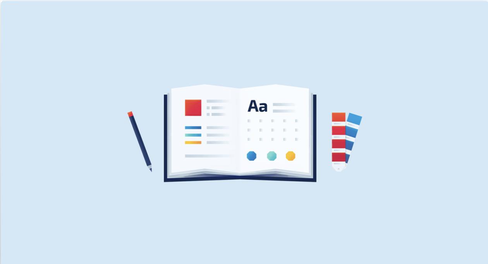

# Preset



Qué es un preset

Un preset es un archivo que se coloca en el proyecto al comienzo de cualquier desarrollo de frontend y que permite “resetear” algunos estilos que vienen por default asociado a determinadas etiquetas de HTML.
Preset

### Preset
```
/*******************
 Box Sizing
 *******************/
html {
  box-sizing: border-box;
  line-height: 1.5;
}

*,
*::before,
*::after {
  box-sizing: border-box;
}

html,
body {
  height: 100%;
}

body {
  min-height: 100vh; /* Useful for body to fill the viewport */
  scroll-behavior: smooth;
  text-rendering: optimizeLegibility;
}

/****************************
 Remove default margin and paddings
 ****************************/
* {
  margin: 0;
  padding: 0;
}

/****************************
 Avoid text overflows
 ****************************/
p,
h1,
h2,
h3,
h4,
h5,
h6 {
  overflow-wrap: break-word;
}

/*******************
 Lists
 *******************/
ul {
  list-style: none;
}

/*******************
 Forms and buttons
 *******************/
input,
textarea,
select,
button {
  color: inherit;
  font: inherit;
  letter-spacing: inherit;
}

/* I usually expand input and textarea to full-width */
input[type='text'],
textarea {
  width: 100%;
}

/* More friendly border */
input,
textarea,
button {
  border: 1px solid gray;
}

/* Friendly password dots
 * See <https://pqina.nl/blog/styling-password-field-dots/>
 */
input[type='password'] {
  font-family: Verdana;
  letter-spacing: 0.125em;
}

/* Some defaults for one-liner buttons */
button {
  padding: 0.75em 1em;
  line-height: inherit;
  border-radius: 0;
  background-color: transparent;
}

button * {
  pointer-events: none;
}

/***********************************
 Better defaults for media elements
 ***********************************/
img,
picture,
video,
iframe,
canvas,
object,
embed,
svg {
  display: block;
  max-width: 100%;
}

/*******************
 Useful table styles
 *******************/
table {
  table-layout: fixed;
  width: 100%;
}

/*******************
 The hidden attribute
 *******************/
[hidden] {
  opacity: 0;
  visibility: hidden;
}

/*******************
 Noscript
 *******************/
noscript {
  display: block;
  margin-bottom: 1em;
  margin-top: 1em;
}

/*******************
 Tabindex
 *******************/
[tabindex='-1'] {
  outline: none !important;
}

/*******************
 Remove animations and transitions
 @see <https://hankchizljaw.com/wrote/a-modern-css-reset/>
 *******************/
@media (prefers-reduced-motion: reduce) {
  * {
    animation-duration: 0.01ms !important;
    animation-iteration-count: 1 !important;
    transition-duration: 0.01ms !important;
    scroll-behavior: auto !important;
  }
}

/*******************
 * Hides content visually.
 * So it's only available to screen readers... and bots 🤖
 * Solution by Joe Watkins.
 * @see <https://zellwk.com/blog/hide-content-accessibly/>
 *******************/
.sr-only,
.visually-hidden {
  position: absolute;
  width: 1px;
  height: auto;
  margin: 0;
  padding: 0;
  border: 0;
  clip: rect(0 0 0 0);
  overflow: hidden;
  white-space: nowrap;
}
```

## Explicación del preset:

* **Configuración de Box Sizing**: Cambiar box-sizing a border-box para facilitar el manejo de  padding y width.
* **Eliminación de Márgenes y Paddings**: Resetear los márgenes y paddings de la mayoría de los elementos.
* **Estilo de Listas**: Eliminar el estilo predeterminado de listas (list-style: none).
* **Formularios y Botones**:
    * Heredar propiedades tipográficas en formularios y botones.
    * Ajustar los estilos de bordes y fondos de los botones.
    * Establecer pointer-events: none en elementos dentro de un botón para facilitar la interacción con JavaScript.
* **Imágenes y Embeds**: Ajustar el ancho máximo y el display de elementos multimedia como  imágenes, videos, iframes, etc.
* **Estilo de Tablas**: Ajustar el layout y el ancho predeterminado de las tablas.
* **Atributo Hidden**: Incrementar la especificidad del atributo hidden para asegurar que los elementos ocultos no se muestren.
* **Estilos para Noscript**: Definir estilos predeterminados para el elemento \<noscript\>\.