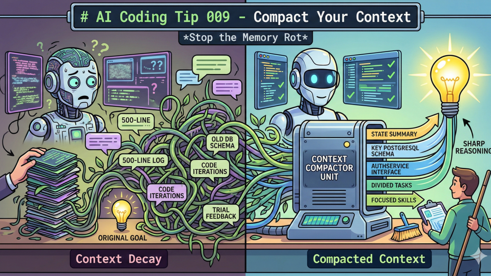

# Compactá tu contexto

Mantener conversaciones largas con una IA deteriora la calidad de sus respuestas. La clave es gestionar activamente el contexto para mantener al modelo enfocado y preciso.

## El problema

Cuando una conversación se extiende demasiado — acumulando logs de errores, iteraciones de código y cambios de requisitos — aparecen estos síntomas:

| Problema | Descripción |
|---|---|
| **Context Decay** | Los objetivos originales se pierden entre tanto intercambio |
| **Alucinaciones** | El modelo inventa funciones o lógica desactualizada para llenar los huecos |
| **Token Waste** | Se reprocesa historial irrelevante en cada llamada |
| **Razonamiento degradado** | Un contexto sobredimensionado reduce la calidad de las respuestas |

> Los modelos priorizan el inicio y el final del contexto, independientemente del tamaño de la ventana. Una ventana grande no garantiza mejor atención al contenido del medio.

## Estrategias

### Gestión de conversaciones
- **Iniciá conversaciones frescas** al completar cada subtarea, en lugar de mantener una sola sesión larga
- **Pedile al modelo un resumen del estado** antes de cerrar una discusión, para llevar lo importante a la próxima sesión
- **Establecé checkpoints de verificación humana** para no perder el hilo de los objetivos

### Gestión del contexto
- **Mantenéun `context.md` mínimo** con el stack actual, reglas del proyecto y decisiones clave
- **Extractá solo las líneas relevantes** de los logs — 5 líneas bien elegidas son más útiles que 200
- **Descomponé tareas grandes** en esfuerzos más pequeños e independientes

### Gestión del conocimiento
- **Distribuí la responsabilidad**: los agentes especialistas no necesitan conocer todo el contexto global
- **Refactorizá el conocimiento aprendido** en habilidades o instrucciones persistentes (ej: reglas en el system prompt)
- **Monitoreá el consumo de la ventana de contexto** para anticiparte antes de que se degrade

## Beneficios

Aplicar estas prácticas resulta en:

- Recomendaciones de código más precisas
- Menos desviaciones de los objetivos del proyecto
- Razonamiento del modelo más fácil de seguir
- Menos correcciones por alucinaciones
- Mayor adherencia a las restricciones del proyecto

## Nivel de aplicación

**Tipo:** Semi-automático | **Nivel:** Intermedio

---

*Fuente: [AI Coding Tip 009 - Compact Your Context](https://www.linkedin.com/pulse/ai-coding-tip-009-compact-your-context-maximiliano-contieri-nkf1f/) — Maximiliano Contieri*
