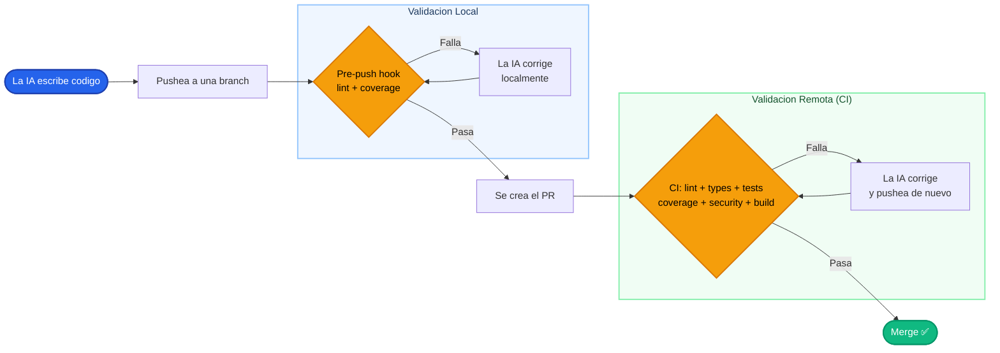

# Handbook IA: Introduccion

Esto no es un tutorial de como usar Claude Code. Esto es una guia de como **construir un sistema de desarrollo** donde la IA trabaja para vos con la calidad que vos definis. La diferencia es enorme.

Si pensas que usar IA para desarrollar es abrir un chat, pedir codigo y pegarlo en tu proyecto, estas perdiendo el 90% del valor. El verdadero poder esta en armar un **pipeline de quality gates** donde la IA produce, se valida automaticamente y se corrige sola. Tu rol como humano es ANTES: disenar el sistema, configurar los linters, definir los hooks, escribir los skills, armar el CI. Vos construis las reglas, la IA las cumple.

## El flujo completo: de la idea al merge

Antes de entrar en detalle, mira el flujo completo. Cada rectangulo es un paso, cada decision es un quality gate. Fijate como los loops de correccion son AUTOMATICOS: la IA no te necesita para arreglar un error de lint o subir el coverage.

Lo que estas viendo es un sistema con **doble capa de validacion** y **loops de correccion automaticos**. La IA es tanto el productor como el que arregla. El humano es el arquitecto del sistema: configura las reglas, define los estandares, arma el pipeline. Despues, la maquina se encarga de cumplirlos. Esa es la filosofia completa de este handbook.

## Stage 1: La IA escribe codigo

Todo arranca aca. La IA genera codigo basandose en tus instrucciones: el `CLAUDE.md` del proyecto, los skills que configuraste, los prompts que le das en la conversacion. Tiene contexto, tiene reglas, tiene ejemplos.

Pero ojo: generar codigo es solo el COMIENZO. Sin guardrails, la IA va a producir codigo que funciona pero que no cumple tus estandares. Va a escribir funciones largas, va a ignorar convenciones de naming, va a generar tests que cubren el happy path y nada mas. Y eso esta bien. Eso es lo ESPERADO. Para eso existen las siguientes etapas.

La calidad no depende de que la IA "sea buena". La calidad depende de que VOS armes un sistema que no deje pasar codigo malo. Es la misma logica que con un equipo humano: no confias en que todos escriban codigo perfecto, confias en el proceso que atrapa los errores.

:::info
La configuracion de `CLAUDE.md` y los skills es lo que determina la calidad BASE del codigo generado. Cuanto mejor sea tu configuracion, menos ciclos de correccion necesitas. Pero la configuracion sola no alcanza: siempre necesitas validacion automatica.
:::

## Stage 2: Validacion local — hooks como primera barrera

Antes de que el codigo salga de tu maquina, el pre-push hook entra en accion. Corre el linter, verifica el coverage minimo, y si algo falla, **rechaza el push**. Asi de simple. El codigo no se sube, la IA ve los errores, los corrige, y vuelve a intentar.

Este es el feedback loop mas barato que existe. No gasta minutos de CI, no crea un PR roto, no manda notificaciones al equipo. Todo pasa localmente, en segundos, sin que nadie se entere.

Y aca esta la clave: la IA NO necesita que vos intervengas para arreglar un error de lint. Si el hook dice "linea 47: prefer-const", la IA cambia el `let` por `const` y pushea de nuevo. Automatico. Sin friccion. Sin costo humano.

:::tip
Los hooks son tu primera linea de defensa. Son rapidos, son locales, y atrapan el 80% de los problemas obvios antes de que lleguen a ningun lado. Configuralos bien y te vas a ahorrar una cantidad absurda de ciclos de CI.
:::

## Stage 3: El CI como validacion final

El CI corre todo de nuevo en un entorno limpio. Lint, types, tests, coverage, security, build. Todo. Desde cero. En una maquina que no tiene tus configuraciones locales, tus variables de entorno, tus dependencias cacheadas.

Por que correr todo de nuevo si los hooks ya validaron? Porque **local puede mentir**. Las dependencias de tu maquina pueden diferir de las del CI. Un hook puede fallar silenciosamente. La IA puede haber hecho algo que pasa en tu OS pero rompe en Linux. El CI es la fuente de verdad. Si el CI pasa, el codigo cumple TODOS tus estandares. Punto final.

Y si el CI falla? La IA lee los errores, corrige, y pushea de nuevo. Otro loop automatico. Otro ciclo que no requiere intervencion humana.

## La clave: doble validacion a costo casi cero

Pensalo asi: con un equipo 100% humano, correr validaciones dos veces (local + CI) y arreglar los errores dos veces tiene un costo real. Es tiempo de una persona. Tiempo caro. Tiempo que podria estar en otra cosa.

Con IA, ese costo es practicamente cero.

La IA corrige un error de lint en milisegundos. Pushea de nuevo en segundos. El CI corre en minutos. Todo el loop de correccion pasa sin que nadie mueva un dedo. Entonces, tener una doble capa de validacion no es "overkill", es GRATIS. Y si es gratis, por que NO lo harias?

Este es el cambio de paradigma: **mas seguridad por menos costo**. Podes ser MAS estricto con tus reglas porque el costo de enforcement bajo a casi cero. Podes exigir 90% de coverage, strict typing, zero warnings, y la IA se encarga de cumplirlo sin quejarse, sin negociar, sin pedir "una excepcion solo por esta vez".

:::tip
No tengas miedo de ser exigente con tus reglas. El costo de enforcement lo paga la maquina. Vos solo tenes que decidir QUE estandares queres. Es como tener un inspector de obra que trabaja gratis las 24 horas.
:::

## Que sigue

Este handbook te guia paso a paso en como armar cada pieza de este sistema. Cada pagina se enfoca en una parte del flujo:

- [**Setup de CI**](./setup-ci.md) — Como configurar tu pipeline para que valide todo lo que la IA produce y le de feedback claro cuando algo falla.
- [**Setup de Linters**](./setup-linters.md) — Las reglas que definen tu estandar de codigo. Sin linters estrictos, la IA hace lo que quiere.
- [**Setup de Hooks**](./setup-hooks.md) — La primera barrera de validacion. Rapida, local, y automatica.
- [**Setup de Skills y CLAUDE.md**](./setup-skills-claude-md.md) — Como configurar las instrucciones y habilidades que le das a la IA para que el codigo generado arranque con la calidad mas alta posible.
- [**Setup de SDD**](./setup-sdd.md) — Spec-Driven Development: como planificar cambios grandes antes de que la IA escriba una sola linea.
- [**Setup de Engram**](./setup-engram.md) — Memoria persistente para que la IA no olvide decisiones, bugs ni convenciones entre sesiones.
- [**Manifiesto**](./manifiesto.md) — Los principios y valores que guian todo esto. El "por que" detras de cada decision.

No importa en que orden los leas, pero si estas arrancando de cero, te recomiendo empezar por el CI y los linters. Son los cimientos. Sin ellos, todo lo demas es decoracion.
