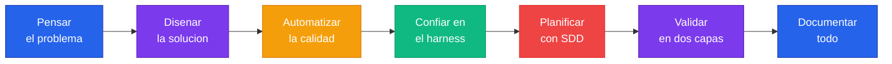

# Manifiesto

Esto no es una lista de sugerencias. Son los principios que definen cómo trabajamos con IA en Flock. No son negociables.

---

## 1. Vos ya no escribis codigo

**Tu trabajo cambio. Ya no sos el que escribe funciones, arregla warnings o conecta componentes. La IA hace eso. Tu rol es PENSAR.**

Aca esta el cambio mental mas dificil de toda tu carrera: dejaste de ser el que tipea. Tu valor nunca estuvo en escribir caracteres en un editor. Tu valor siempre estuvo en las DECISIONES detras del codigo. Que se construye, por que, con que estandares, bajo que arquitectura. Esas decisiones siguen siendo tuyas.

La IA es un multiplicador de 10x, pero solo si soltas el teclado y te enfocas en lo que realmente importa: el diseño del sistema, la barra de calidad, el problema que estas resolviendo. Si seguís escribiendo codigo a mano, estas haciendo el trabajo equivocado.

---

## 2. El humano disena, la IA ejecuta

**Vos definis las reglas, la arquitectura, los estandares. La IA escribe el codigo que cumple con todo eso.**

La relacion es como la de un arquitecto y un constructor. No queres que tu arquitecto este poniendo ladrillos, y no queres que tu albanil tome decisiones de diseño. El criterio tecnico es tuyo, la velocidad de ejecucion es de la IA.

Esto no te hace menos tecnico. Te hace MAS tecnico. Porque ahora tu trabajo es puro pensamiento critico: elegir patrones, definir contratos, anticipar problemas. La parte mecanica la delega a quien la hace mejor y mas rapido.

---

## 3. La calidad no se negocia, se automatiza

**Linters al maximo, hooks que bloquean, CI que rechaza. El costo de enforcement con IA es practicamente cero.**

Todo lo que antes era "nice to have" ahora es obligatorio. Por que? Porque el costo de cumplir bajo a casi nada. La IA no se queja si le pedis que arregle 47 warnings de lint. No se cansa, no negocia, no dice "despues lo arreglo". Entonces no hay excusa para bajar la barra.

Configura tus [linters al maximo](./setup-linters.md), tus [hooks que bloqueen](./setup-hooks.md), tu [CI que rechace](./setup-ci.md). La calidad deja de ser un costo y se convierte en un default.

---

## 4. Confia en tu harness

**Si tu pipeline pasa, el codigo cumple tus reglas. No necesitas leer cada linea.**

Este es el miedo mas comun: "pero yo no vi ese codigo". Y la pregunta es: que importa si lo viste o no? Si configuraste linters estrictos, hooks que bloquean, CI que rechaza, y tests con coverage alto — el codigo que atraviesa TODAS esas barreras cumple con tus estandares. No porque vos lo revisaste, sino porque tu sistema lo valido.

El miedo a codigo que no leiste viene de no confiar en tu sistema de validacion. Si no confias, el problema no es el codigo generado — es que tu harness no es lo suficientemente estricto. La respuesta no es volver a leer cada linea. La respuesta es [mejorar tus linters](./setup-linters.md), [endurecer tus hooks](./setup-hooks.md), [subir la exigencia del CI](./setup-ci.md). Cuanto mas estricto sea tu harness, menos necesitas mirar. Es asi de simple.

---

## 5. Pensa antes de codear

**Todo cambio significativo pasa por SDD: explorar, especificar, diseñar, implementar, verificar.**

La IA escribe specs y documentos de diseño en segundos. SEGUNDOS. Saltarte la planificacion no es ir mas rapido — es acumular deuda tecnica que se compone con cada feature. Y con la velocidad que te da la IA, esa deuda se acumula mas rapido que nunca.

[SDD](./setup-sdd.md) es tu red de seguridad. Exploras el problema, especificas lo que vas a construir, disenas como lo vas a hacer, y recien ahi implementas. No es burocracia. Es lo que separa un sistema mantenible de un desastre con git blame.

---

## 6. Doble validacion, cero costo

**Hooks validan local, CI valida remoto. Dos barreras, dos oportunidades de atrapar errores.**

Con developers humanos, esta doble validacion era "overkill". Con IA, es GRATIS. El costo de corregir en cada barrera es practicamente cero — le decis a la IA "arregla lo que fallo" y en segundos esta resuelto. Entonces, por que NO lo harias?

Dos checkpoints, dos redes de seguridad. [Hooks locales](./setup-hooks.md) atrapan errores antes del commit. [CI remoto](./setup-ci.md) atrapa lo que se escapo. Sin excusas.

---

## 7. Todo queda documentado

**Cada decision, cada spec, cada diseño persiste como un artefacto. La respuesta siempre existe.**

Cuando dentro de 6 meses alguien pregunte "por que se construyo asi?", la respuesta tiene que estar. No en la cabeza de alguien que ya se fue del equipo. No en un mensaje de Slack enterrado. En un artefacto trazable: specs de SDD, CLAUDE.md, skills, ADRs.

Se acabo el "conocimiento tribal". Todo lo que se decide, se documenta. Todo lo que se disena, se registra. Esa es la unica forma de escalar un equipo sin perder contexto.

---

> La IA no te reemplaza. Te AMPLIFICA. Pero solo si dejas de competir con ella en lo que hace mejor — escribir codigo — y te enfocas en lo que solo vos podes hacer: pensar, decidir, diseñar.
