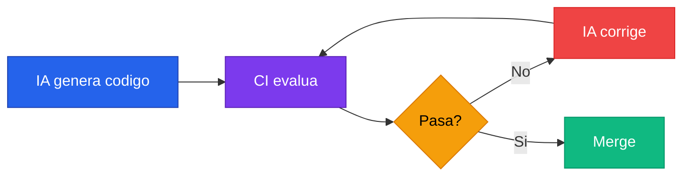

# Setup de CI

---

## El CI ya no es solo para humanos

Pensalo un segundo. Durante anos, el pipeline de CI fue una red de seguridad para el equipo humano: corria los tests, chequeaba el formato, y si algo fallaba, un dev se sentaba a arreglarlo. El costo de cada fix era tiempo de una persona. Tiempo caro. Tiempo finito.

Ahora la ecuacion cambio por completo.

Cuando usas IA para escribir codigo, el CI se convierte en algo mucho mas poderoso: es el **layer de enforcement** que obliga a la IA a cumplir tus reglas. Ya no es solo una red de seguridad, es un **inspector de obra**. Vos sos el arquitecto, la IA es el constructor, y el CI es el inspector municipal que no deja pasar ni una pared que no cumpla con el codigo de edificacion.

Y aca viene lo importante: la IA va a tomar atajos si vos la dejas. Va a generar codigo que "funciona" pero no respeta tus convenciones. Va a saltarse tipos estrictos, va a ignorar edge cases en los tests, va a escribir funciones de 80 lineas si nadie le dice que no. El CI es ese "alguien" que le dice que no. Automaticamente. Sin cansarse. Sin negociar.

### El loop automatico



Ese ciclo es **automatico** y cuesta practicamente nada. No hay un humano sentado arreglando warnings de linter a las 6 de la tarde. No hay un dev discutiendo si "esa regla es demasiado estricta". La maquina genera, la maquina valida, la maquina corrige.

:::tip[Mensajes claros para la IA]
Cuando Claude Code corre en modo CI (por ejemplo con `claude --ci`), puede leer los errores del pipeline y autocorregirse. Asegurate de que los mensajes de error de cada check sean claros y descriptivos: la IA necesita entender QUE fallo y POR QUE para poder arreglarlo.
:::

---

## El CI como documentacion viva

Hay algo que nadie dice pero todos saben: las guias de estilo en un wiki no las lee nadie. Escribis 15 paginas de "coding standards", las pones en Confluence o Notion, y a los dos meses estan desactualizadas y nadie las consulta.

Tu configuracion de CI **es** tu estandar de codigo. No es un documento que describe lo que deberia ser; es un sistema que EJECUTA lo que debe ser.

> Si tu CI rechaza funciones sin tipos de retorno, ese **ES** tu estandar.
> Si tu CI pide 85% de coverage, ese **ES** tu threshold.
> No hay ambiguedad. No hay interpretacion. No hay "yo pense que era de otra forma".

Y esto tiene una consecuencia practica enorme para equipos que usan IA: cuando arrancas una nueva sesion de Claude Code, no necesitas explicarle todos tus estandares. El agente genera codigo, el CI lo rechaza si no cumple, y el agente aprende de los errores. Tu CI le esta ensenando tus estandares en tiempo real, en cada push.

Cuando se suma un dev nuevo al equipo, pasa lo mismo. No necesita leerse un documento de 40 paginas. Pushea, el CI le dice que esta mal, corrige. Aprendizaje por feedback inmediato. Como debe ser.

:::info[CI + CLAUDE.md = complementarios]
Si usas `CLAUDE.md` o skills para definir convenciones, el CI es la **verificacion** de que esas convenciones se cumplen. Las instrucciones le dicen a la IA COMO escribir codigo; el CI verifica que efectivamente lo hizo bien. Son complementarios, no redundantes.
:::

---

## Que deberia verificar tu CI

Un pipeline de CI serio para equipos que trabajan con IA deberia cubrir estas areas. Cada check tiene que producir mensajes de error claros y accionables para que la IA pueda autocorregirse.

### Checks esenciales

| Check | Ejemplos por stack | Proposito |
|:---|:---|:---|
| **Linting** | ESLint, Biome, Checkstyle, SonarLint | Estilo, patrones, errores comunes |
| **Formato** | Prettier, Biome, google-java-format, dotnet-format | Formato consistente sin discusiones |
| **Compilacion / Type checking** | `tsc --noEmit`, `mvn compile`, `dotnet build` | Verificar que el proyecto compila sin errores |
| **Tests** | Jest, Vitest, JUnit, xUnit, Karma | Validacion funcional con coverage threshold |
| **Seguridad** | `npm audit`, `mvn dependency-check`, Snyk, OWASP | Dependencias sin vulnerabilidades conocidas |

### Checks avanzados

| Check | Ejemplos por stack | Proposito |
|:---|:---|:---|
| **Complejidad** | Reglas de complejidad ciclomatica del linter | Funciones simples y mantenibles |
| **Bundle / artifact size** | size-limit, webpack-bundle-analyzer | Detectar regresiones de tamano |
| **Conventional commits** | commitlint, gitlint | Mensajes de commit consistentes |
| **PR size** | Custom check o GitHub Action | PRs chicos y revisables |

---

## Ejemplo practico: GitHub Actions

Estos son dos ejemplos de workflows de GitHub Actions. Elegí el que se ajuste a tu stack, adaptalo a tus herramientas, y usalo como punto de partida.

Ambos siguen la misma estructura: **dos jobs en paralelo**. Uno de calidad (formato, lint, compilacion, tests, build) y otro de seguridad (audit de dependencias). Si uno falla, el otro sigue corriendo — asi tenes feedback de ambos frentes al mismo tiempo sin esperar secuencialmente.

:::tip[Jobs en paralelo]
Separar calidad y seguridad en jobs distintos te da feedback mas rapido. Si el linting falla en el minuto 1, no necesitas esperar 5 minutos a que termine el audit de seguridad para enterarte. Cada job falla independientemente.
:::

### Node / TypeScript (Angular, React, NestJS)

El job de **quality** sigue el orden de fail fast: primero lo mas rapido (formato), despues lint, tipos, tests y build al final. Si el formato esta roto, no tiene sentido correr los tests.

El job de **security** corre `npm audit` para detectar vulnerabilidades conocidas en las dependencias. El flag `--audit-level=high` ignora las de severidad baja y media para evitar falsos positivos que frenen el pipeline innecesariamente.

```yaml title=".github/workflows/ci.yml"
name: CI

on:
  pull_request:
    branches: [main, dev]
  push:
    branches: [main, dev]

concurrency:
  # Cancela runs anteriores de la misma branch para no desperdiciar minutos
  group: ${{ github.workflow }}-${{ github.ref }}
  cancel-in-progress: true

jobs:
  quality:
    name: Quality Checks
    runs-on: ubuntu-latest
    steps:
      - uses: actions/checkout@v4

      - uses: actions/setup-node@v4
        with:
          node-version: 20
          cache: 'npm'

      # npm ci instala versiones EXACTAS del lockfile — reproducible
      - run: npm ci

      # 1. Formato — lo mas rapido, falla en segundos
      - name: Check formatting
        run: npx prettier --check .

      # 2. Lint — reglas estrictas, cero warnings tolerados
      - name: Lint
        run: npx eslint . --max-warnings 0

      # 3. Type check — valida tipos sin emitir archivos
      - name: Type check
        run: npx tsc --noEmit

      # 4. Tests — con reporte detallado y coverage
      - name: Tests with coverage
        run: npx vitest run --coverage --reporter=verbose

      # 5. Build — si todo lo anterior paso, verificamos que compile
      - name: Build
        run: npm run build

  security:
    name: Security Audit
    runs-on: ubuntu-latest
    steps:
      - uses: actions/checkout@v4
      - uses: actions/setup-node@v4
        with:
          node-version: 20
          cache: 'npm'
      - run: npm ci
      # Solo falla con vulnerabilidades high o critical
      - name: Audit dependencies
        run: npm audit --audit-level=high
```

### Java (Spring Boot, Maven)

La misma logica pero adaptada al ecosistema Java. El job de **quality** usa `fmt-maven-plugin` para formato (basado en google-java-format), Checkstyle para lint, y `mvn verify` para correr tests con el plugin de coverage configurado en el `pom.xml`.

El job de **security** usa el plugin de OWASP para escanear dependencias contra la base de datos de vulnerabilidades conocidas (NVD). Es mas lento que `npm audit` porque descarga la base local, pero es el estandar de la industria para Java.

```yaml title=".github/workflows/ci.yml"
name: CI

on:
  pull_request:
    branches: [main, dev]
  push:
    branches: [main, dev]

jobs:
  quality:
    name: Quality Checks
    runs-on: ubuntu-latest
    steps:
      - uses: actions/checkout@v4

      - uses: actions/setup-java@v4
        with:
          distribution: 'temurin'
          java-version: '21'
          cache: 'maven'

      # 1. Formato — google-java-format via Spotify plugin
      - name: Check formatting
        run: mvn com.spotify.fmt:fmt-maven-plugin:check

      # 2. Lint — Checkstyle con las reglas del proyecto
      - name: Lint (Checkstyle)
        run: mvn checkstyle:check

      # 3. Compilacion — verifica que el codigo compila
      - name: Compile
        run: mvn compile -q

      # 4. Tests — mvn verify corre unit + integration tests
      - name: Tests with coverage
        run: mvn verify -q

      # 5. Build — empaqueta sin re-correr tests
      - name: Build
        run: mvn package -DskipTests -q

  security:
    name: Security Audit
    runs-on: ubuntu-latest
    steps:
      - uses: actions/checkout@v4
      - uses: actions/setup-java@v4
        with:
          distribution: 'temurin'
          java-version: '21'
          cache: 'maven'
      # OWASP dependency-check contra la NVD
      - name: OWASP Dependency Check
        run: mvn org.owasp:dependency-check-maven:check
```

---

## Practicas clave para el loop con IA

Para que el ciclo de "generar, validar, corregir" funcione de manera fluida:

### Mensajes de error descriptivos

Cada regla de lint, cada test que falla, cada error de tipos tiene que producir un mensaje que la IA pueda interpretar y actuar.

| Malo | Bueno |
|:---|:---|
| `Error en linea 42` | `La funcion calculateTotal excede el limite de complejidad ciclomatica (15/10)` |
| `Test failed` | `Expected calculateTotal([10, 20]) to return 30, but got undefined` |
| `Lint error` | `NamingConvention: el metodo 'GetData' no respeta camelCase (linea 42)` |

### Fail fast

Ordena los checks de mas rapido a mas lento:

```
formato → lint → compilacion → tests → build
```

Si el formato esta mal, no tiene sentido correr los tests. El feedback tiene que llegar lo antes posible.

### Branch protection

Configura reglas de proteccion en `main` y `dev` que requieran que **TODOS** los checks pasen antes de permitir el merge. Sin excepciones. Sin "override by admin". Si el CI no pasa, no se mergea. Punto.

### Reproducibilidad local

Asegurate de que el dev (o la IA) pueda correr los mismos checks localmente antes de pushear. Si los checks solo corren en CI, el ciclo de feedback se hace lento e ineficiente. Idealmente, tus pre-commit hooks corren un subset rapido de los mismos checks.

---

:::warning[Conclusion]
El CI ya no es un costo operativo que "hay que bancar". Es la herramienta mas poderosa que tenes para mantener la calidad cuando trabajas con IA. Cuanto mas estricto sea tu pipeline, mejor codigo va a producir la IA. **Es asi de simple.**
:::
