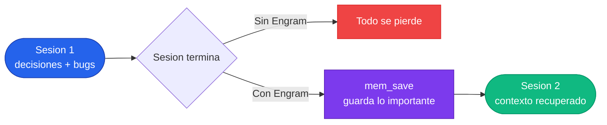
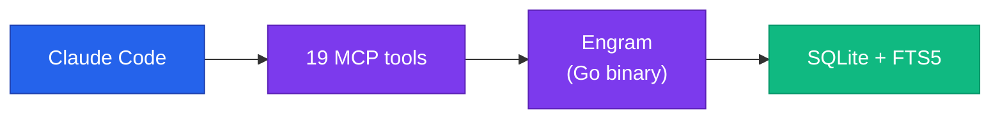
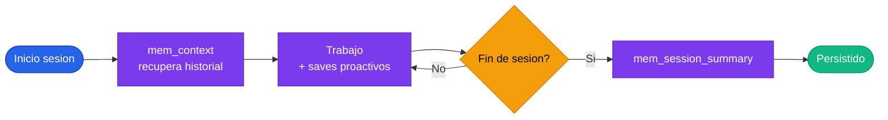

# Setup de Engram

---

## Por que no alcanza con la compactacion

La compactacion de contexto es la forma en que los agentes manejan conversaciones largas: cuando el contexto se llena, el sistema comprime los mensajes anteriores en un resumen mas corto. Suena razonable, pero tiene problemas serios.

Primero, es **costosa**. Cada compactacion requiere una llamada LLM para generar el resumen. En sesiones largas con multiples compactaciones, ese costo se acumula — estas pagando tokens extras solo para que el agente recuerde lo que ya hizo.

Segundo, y mas importante, es **lossy**. El resumen inevitablemente pierde detalles. Esa decision arquitectural que discutiste en detalle? Queda reducida a una oracion. El root cause de un bug que tardaste 20 minutos en diagnosticar? Se pierde en la compresion. Y cuantas mas compactaciones encadenas, peor se pone — cada resumen se comprime sobre el resumen anterior, acumulando perdida de informacion.

Y tercero, la compactacion solo te ayuda DENTRO de la misma sesion. Cuando la sesion termina, no importa cuantas veces se haya compactado — todo desaparece. La siguiente sesion arranca desde cero, y repetis las mismas conversaciones, re-explicás contexto que ya diste, y la IA comete errores que ya corregiste antes.



Engram resuelve ambos problemas. Las decisiones importantes se guardan en una base de datos ANTES de que ocurra cualquier compactacion. Si el contexto se limpia — por compactacion o por fin de sesion — el agente llama `mem_context` y recupera exactamente lo que necesita. Podes limpiar el contexto con confianza, sabiendo que nada critico se pierde.

> La compactacion comprime TODO y espera que nada importante se pierda. Engram guarda SOLO lo importante y garantiza que sobreviva.

Otras herramientas como **claude-mem** atacan el mismo problema pero con una filosofia opuesta: capturan todo automaticamente y despues comprimen con un LLM extra. Engram toma el camino inverso — el agente, que ya ES un LLM con capacidad de razonamiento, decide que vale la pena recordar mediante llamadas explicitas a `mem_save`. Esto produce datos mas limpios, busquedas mas efectivas, cero llamadas LLM extra, y cero procesos adicionales.

---

## Como funciona

**Engram** es un binario Go de dependencia cero. Usa SQLite + FTS5 para busqueda full-text y se expone via protocolo MCP con 19 tools. El diseño es deliberadamente simple: un proceso local, una base de datos local, cero servicios externos requeridos.



La divulgacion progresiva de tokens es clave: `mem_search` devuelve previews compactos con IDs, y solo busca el contenido completo cuando llamas a `mem_get_observation`. Eso significa que buscar 100 observaciones no te cuesta 100 veces el contexto.

---

## Los tools fundamentales

Hay 19 tools en total, pero estos 6 cubren el 90% de los casos de uso del dia a dia:

| Tool | Que hace | Cuando usarlo |
|:-----|:---------|:--------------|
| `mem_save` | Guarda una observacion estructurada | Despues de decisiones, bugfixes, descubrimientos |
| `mem_search` | Busca en la base con FTS5 | Cuando necesitas recordar algo de sesiones pasadas |
| `mem_context` | Trae historial reciente de la sesion | Al inicio de cada sesion |
| `mem_session_summary` | Persiste un resumen al cerrar sesion | SIEMPRE antes de terminar una sesion |
| `mem_get_observation` | Trae contenido completo sin truncar | Despues de mem_search, para ver el detalle |
| `mem_suggest_topic_key` | Sugiere un topic_key consistente | Cuando no estas seguro del key correcto |

Los 13 tools restantes cubren actualizaciones, borrado, sincronizacion, y administracion. Los necesitas eventualmente, pero no para el flujo diario.

---

## Estructura de una observacion

Cada observacion tiene un formato estructurado que la hace buscable y util en sesiones futuras:

```markdown title="Ejemplo de mem_save"
title: "Fixed N+1 query in UserList"
type: "bugfix"
scope: "project"
topic_key: "bugs/user-list-n-plus-1"
content:
  What: Resolved N+1 query in UserList component
  Why: Page load was 3s due to individual DB calls per user
  Where: src/users/user-list.service.ts
  Learned: Prisma include doesn't batch — use findMany with joins
```

Los campos que mas importan:

- **title**: verbo + que, corto y buscable. Bien: "Fixed N+1 query in UserList". Mal: "arregle un bug".
- **type**: `bugfix | decision | architecture | discovery | pattern | config | preference`. Le da estructura a las busquedas.
- **scope**: `project` para cosas del proyecto (default), `personal` para preferencias de workflow propias.
- **topic_key**: clave estable para upserts. Si usas el mismo key en dos saves, el segundo actualiza en vez de duplicar.

---

## Ciclo de vida de una sesion

El flujo correcto de una sesion con Engram tiene tres momentos clave: recuperar contexto al inicio, guardar proactivamente durante el trabajo, y persistir un resumen al final.



`mem_session_summary` NO es opcional. Si cerrás una sesion sin llamarlo, la siguiente sesion arranca ciega — sin saber que se hizo, que se decidio, ni que queda pendiente. Es el paso que cierra el loop.

---

## Integracion con SDD

Engram es la capa de persistencia de SDD. Proposals, specs, designs, tasks, reportes de verify — todo se guarda en Engram y sobrevive resets de contexto y compactaciones. Podes generar un spec en una sesion y correr `apply` en otra sesion totalmente diferente.

Sin persistencia, SDD no funcionaria con IA. El pipeline de fases solo tiene sentido si los artefactos de cada fase estan disponibles para la siguiente, independientemente de cuando corra.

Para entender como SDD usa Engram como backend, consulta el [Setup de SDD](./setup-sdd.md).

---

## Equipos: scopes y sincronizacion

Engram distingue entre dos scopes para organizar que es compartido y que es personal:

| Scope | Que guardar | Ejemplo |
|:------|:-----------|:--------|
| `project` | Decisiones arquitecturales, bugfixes, convenciones | "Auth usa JWT con refresh tokens" |
| `personal` | Preferencias de workflow, notas personales | "Prefiero usar vim mode en VS Code" |

Para sincronizar entre maquinas, `engram sync` exporta chunks comprimidos que nunca generan merge conflicts. Commiteás la carpeta `.engram/` en el repo e importas en otra maquina. La base SQLite local es SIEMPRE la fuente de verdad — la sincronizacion es replicacion, no ownership.

:::info
FTS5 busca por texto completo pero no es multilenguaje — una busqueda en ingles no encuentra observaciones en español y viceversa. Conviene mantener consistencia: scope `project` en el idioma del equipo, scope `personal` en el que prefieras.
:::

---

:::tip[Conclusion]
Sin memoria persistente, cada sesion con IA arranca ciega. Engram resuelve esto dejando que el agente cure lo que vale la pena recordar: decisiones, bugs, convenciones, descubrimientos. No es un log — es una base de conocimiento que crece con cada sesion y hace que la siguiente sea mejor que la anterior.
:::
