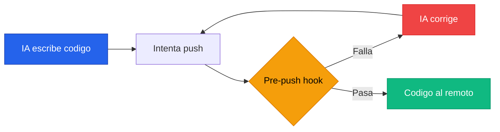
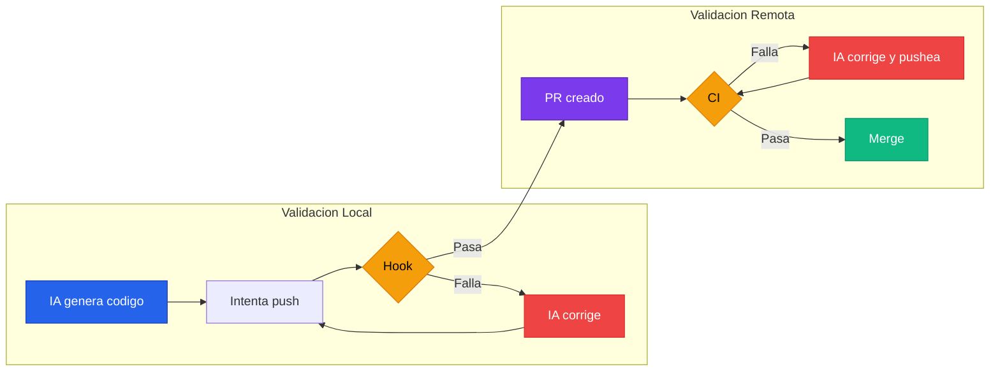

# Setup de Hooks

---

## La primera barrera: feedback en segundos

Pensalo asi. Cada vez que la IA genera codigo y lo pushea directo al remoto, el CI tarda minutos en decirte que habia un `console.log` olvidado o un tipo mal definido. Minutos de pipeline. Minutos de espera. Minutos de CI que le cuestan plata a tu organizacion. Y todo por algo que se podia detectar ANTES de que el codigo saliera de tu maquina.

Los hooks son exactamente eso: la validacion que corre localmente, en segundos, antes de que el codigo toque el remoto.

La analogia es directa. Si el CI es el profesor que corrige tu examen, los hooks son vos revisando tus respuestas antes de entregar. Por que le vas a hacer perder tiempo al profesor con errores de ortografia que podias corregir en 5 segundos?

Y aca esta lo clave: para un humano, correr lint + tests antes de cada push puede sentirse tedioso. Para la IA, es transparente. Claude Code lee el error del hook, lo arregla, y vuelve a intentar. Sin frustracion. Sin costo. Sin excusas.

> Los hooks son el feedback loop mas barato que existe.
> **Corren en tu maquina, en segundos, y le ahorran minutos de CI a todo el equipo.**

---

## El loop de feedback local

Asi es como funciona el ciclo cuando tenes hooks configurados. La IA no necesita esperar al CI para saber si el codigo esta bien:



Ese loop es LOCAL. No consume minutos de CI. No genera notificaciones. No bloquea a nadie. La IA lo resuelve sola antes de que el codigo salga de tu maquina.

---

## Que tipos de hooks usar

Git te da varios puntos donde podes interceptar el flujo. No todos tienen el mismo proposito ni el mismo costo:

| Hook | Cuando corre | Que validar | Por que |
|:---|:---|:---|:---|
| **pre-commit** | Al hacer commit | Formato, lint rapido | Atrapa errores de formato antes de que lleguen al historial |
| **commit-msg** | Al escribir el mensaje | Formato de conventional commits | Mensajes consistentes para changelogs automaticos |
| **pre-push** | Al pushear | Lint completo, tests, compilacion | Ultima barrera antes de que el codigo salga de tu maquina |

:::tip[Pre-push como punto principal de enforcement]
Nuestra recomendacion es usar **pre-push** como el hook principal. Por que? Porque `pre-commit` corre en CADA commit, y cuando la IA esta trabajando hace muchos commits chicos (WIP, iteraciones, ajustes). Forzar lint completo + tests en cada commit es lento e innecesario. En cambio, `pre-push` corre una sola vez antes de pushear — que es el momento justo donde necesitas garantizar calidad. La IA puede hacer 10 commits tranquilamente, y solo se valida todo junto cuando va a salir al remoto.
:::

Si queres, podes combinar ambos: un `pre-commit` liviano que solo formatee (rapido, no molesta) y un `pre-push` completo que corra lint + tests + compilacion. Lo importante es que el enforcement pesado este en el pre-push.

---

## Herramientas por ecosistema

### Node / TypeScript: Husky + lint-staged

Para proyectos Node, la combinacion estandar es:

- **Husky**: maneja los git hooks desde tu `package.json`. Cuando alguien clona el repo y corre `npm install`, los hooks se instalan automaticamente. No hay que configurar nada a mano.
- **lint-staged**: corre linters SOLO sobre los archivos que cambiaron. Si tocaste 3 archivos, no necesitas lintear los 500 del proyecto. Esto hace que el pre-commit sea rapido incluso en proyectos grandes.

### Java: scripts de shell + Maven

Java no tiene un equivalente directo a Husky, pero no lo necesitas. Un script de shell en `.git/hooks/pre-push` que corra `mvn checkstyle:check compile test` hace exactamente lo mismo. Para automatizar la instalacion del hook, podes usar el `maven-git-hook-plugin` o simplemente documentar el comando en el README.

---

## Configuracion recomendada por stack

### Node / TypeScript (Angular, React, NestJS)

Primero, instala las dependencias:

```bash title="Terminal"
npm install -D husky lint-staged
npx husky init
```

#### Pre-commit: solo formato (rapido)

Este hook corre en cada commit pero SOLO formatea los archivos que cambiaron. Es tan rapido que ni lo notas. Usa `lint-staged` para limitar el scope a los archivos del staging area.

La configuracion de `lint-staged` le dice: "para archivos `.ts`, `.tsx`, `.js` y `.jsx`, correr Prettier en modo escritura. Para archivos `.css` y `.scss`, lo mismo." Solo toca lo que cambio, no el proyecto entero.

```json title="package.json (seccion lint-staged)"
{
  "lint-staged": {
    "*.{ts,tsx,js,jsx}": ["prettier --write"],
    "*.{css,scss}": ["prettier --write"],
    "*.{json,md,yml,yaml}": ["prettier --write"]
  }
}
```

```bash title=".husky/pre-commit"
npx lint-staged
```

#### Pre-push: validacion completa

Este es el hook que importa. Antes de que el codigo salga de tu maquina, corre lint estricto (cero warnings tolerados), verificacion de tipos, y la suite de tests. Si algo falla, el push se cancela y la IA corrige localmente.

El orden sigue la misma logica de fail fast que usamos en el CI: primero lo mas rapido (lint), despues tipos, despues tests. Si el lint falla, no tiene sentido correr los tests.

```bash title=".husky/pre-push"
echo "Pre-push: validando calidad..."

# 1. Lint — cero warnings, sin negociacion
npx eslint . --max-warnings 0

# 2. Type check — valida tipos sin emitir archivos
npx tsc --noEmit

# 3. Tests — corren todos, con coverage
npx vitest run --coverage
```

#### Commit-msg: conventional commits

Si usas conventional commits para generar changelogs automaticos, este hook valida que el mensaje del commit siga el formato correcto. Necesitas instalar `@commitlint/cli` y `@commitlint/config-conventional`.

```bash title="Terminal"
npm install -D @commitlint/cli @commitlint/config-conventional
```

```js title="commitlint.config.js"
export default {
  extends: ['@commitlint/config-conventional'],
};
```

```bash title=".husky/commit-msg"
npx --no -- commitlint --edit ${1}
```

### Java (Spring Boot, Maven)

Para Java, el hook es un script de shell directo. No necesitas herramientas adicionales — Maven ya tiene todo lo que necesitas.

#### Pre-push: Checkstyle + compilacion + tests

Este script corre tres validaciones en orden: primero Checkstyle (lint), despues compilacion, y por ultimo los tests. Si cualquiera de los tres falla, el push se cancela.

El flag `-q` (quiet) reduce el output de Maven para que los errores sean mas faciles de leer — tanto para vos como para la IA.

```bash title=".git/hooks/pre-push"
#!/bin/sh
echo "Pre-push: validando calidad..."

# 1. Checkstyle — estilo y convenciones
mvn checkstyle:check -q
if [ $? -ne 0 ]; then
    echo "Checkstyle fallo. Corregi los errores antes de pushear."
    exit 1
fi

# 2. Compilacion — verifica que todo compila
mvn compile -q
if [ $? -ne 0 ]; then
    echo "La compilacion fallo. Corregi los errores antes de pushear."
    exit 1
fi

# 3. Tests — corre toda la suite
mvn test -q
if [ $? -ne 0 ]; then
    echo "Los tests fallaron. Corregi los errores antes de pushear."
    exit 1
fi

echo "Todas las validaciones pasaron. Pusheando..."
```

:::info[Automatizar la instalacion del hook en Java]
Para que el hook se instale automaticamente cuando alguien clona el repo, podes agregar un script en el `pom.xml` que copie el archivo a `.git/hooks/` durante la fase `initialize`. Otra opcion es usar el `git-build-hook` plugin de Maven, que maneja esto por vos.
:::

---

## Que NO poner en hooks

Los hooks tienen que ser RAPIDOS. Si tardan mas de 30 segundos, los devs (y la IA) van a buscar la manera de saltarselos. Y con razon.

| Pertenece a hooks | Pertenece a CI |
|:---|:---|
| Lint rapido (ESLint, Checkstyle) | Tests end-to-end (Cypress, Playwright) |
| Verificacion de tipos (`tsc --noEmit`) | Builds completos de produccion |
| Tests unitarios | Security audit (`npm audit`, OWASP) |
| Formato (`prettier --check`) | Analisis estatico pesado (SonarQube) |
| Validacion de commit message | Bundle size analysis |

:::warning[Los hooks son un SUBSET del CI]
Nunca pongas algo en hooks que no este TAMBIEN en el CI. Los hooks se pueden saltear (`--no-verify`). El CI no. Los hooks son una conveniencia para atrapar errores temprano; el CI es la barrera obligatoria. Si un check solo esta en hooks y no en CI, es como tener una puerta con llave pero dejar la ventana abierta.
:::

La regla es simple: si tarda menos de 30 segundos y atrapa errores obvios, va en hooks. Si tarda mas o necesita infraestructura especial, va en CI.

---

## Hooks + IA = el loop mas rapido

Aca es donde todo cierra. Cuando la IA trabaja con hooks configurados, el flujo es:



Todo esto pasa en SEGUNDOS. Sin intervencion humana. Sin esperar pipelines. Sin crear PRs que fallan. La IA se autocorrige localmente antes de que el codigo toque el remoto.

Y lo mejor: si tenes los linters configurados al maximo (como explica la [guia de linters](./setup-linters.md)), los hooks van a atrapar el 80% de los problemas antes de que lleguen al CI. Eso significa menos builds rojos, menos ruido en las notificaciones, y menos minutos de CI consumidos.

> Los hooks no reemplazan al CI. Lo COMPLEMENTAN.
> **Son la primera barrera, la mas rapida, la mas barata. Y con IA, el costo de tenerlos es literalmente cero.**

:::tip[El setup completo]
Hooks locales + CI remoto es la doble validacion que te garantiza calidad. Los hooks atrapan lo obvio en segundos. El CI valida todo — incluyendo lo que los hooks no cubren (e2e, seguridad, builds completos). El costo de mantener ambos es minimo, y el beneficio es enorme.
:::
