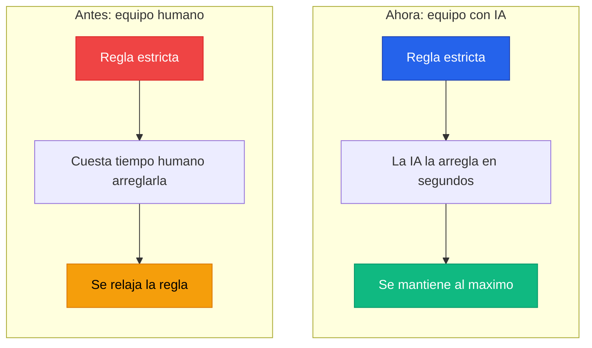

# Setup de Linters

---

## El cambio de paradigma

Aca es donde la cosa se pone realmente interesante, y donde la mayoria de los equipos todavia no se dieron cuenta de lo que cambio.

En un equipo tradicional, las reglas de linting se mantienen "razonables". Y tiene sentido: si pones un threshold de coverage del 90%, cada vez que alguien toca un archivo tiene que escribir tests para llegar a ese numero. Eso lleva tiempo. Tiempo humano. Caro. Entonces los equipos negocian: "con 70% estamos bien", "esa regla de complejidad ciclomatica es muy agresiva, relajemosla", "el strict mode nos frena mucho". Decisiones pragmaticas basadas en una restriccion real: el tiempo humano es limitado.

Pero con IA, esa restriccion **desaparecio**.



El costo de que la IA arregle un warning de lint es practicamente cero. El costo de que escriba tests para subir el coverage es practicamente cero. El costo de que refactorice una funcion para bajar la complejidad ciclomatica es practicamente cero.

> Entonces, por que seguirias manteniendo las reglas "relajadas" de antes?
> **Subir la exigencia al maximo no es un capricho. Es la consecuencia logica del cambio de herramientas.**

---

## Que subir al maximo

Cosas que antes eran "nice to have" ahora pueden — y deberian — ser obligatorias:

| Area | Que exigir | Por que |
|:---|:---|:---|
| **Linting estricto** | Todas las reglas activadas, cero warnings tolerados | La IA corrige cada warning en segundos. No hay excusa para dejar pasar ni uno |
| **Coverage alto** | 80%, 90%, lo que tenga sentido para tu proyecto | La IA genera los tests. El costo de subir coverage bajo drasticamente |
| **Tipado estricto** | Modo strict del compilador o del lenguaje al maximo | Tipos estrictos atrapan bugs antes de runtime. La IA los resuelve sin quejarse |
| **Limites de complejidad** | Funciones cortas, complejidad ciclomatica acotada | Codigo simple = codigo mantenible. La IA refactoriza automaticamente |
| **Seguridad** | Audit de dependencias, scanning de secrets | No negociable. Ni con humanos ni con IA |
| **Documentacion** | Comentarios en funciones publicas donde corresponda | La IA documenta mas rapido que cualquier dev. Aprovechalo |

:::warning[Reglas con proposito]
Subir la exigencia no significa poner reglas arbitrarias. Cada regla tiene que tener un PROPOSITO claro. No se trata de torturar a la IA (ni al dev que revisa el PR), se trata de que el codigo que llega a `main` sea de la mejor calidad posible. Si una regla no agrega valor, sacala. Pero si la sacaste porque "era dificil de cumplir"... con IA ya no tenes esa excusa.
:::

---

## Que linter usar segun tu stack

No existe un linter universal. Cada ecosistema tiene sus herramientas. Lo importante es que elijas una, la configures al maximo, y la hagas obligatoria en el CI y en los hooks.

### Frontend

| Stack | Linter | Formatter | Notas |
|:---|:---|:---|:---|
| **Angular** | ESLint + `angular-eslint` | Prettier o Biome | `angular-eslint` agrega reglas especificas de Angular (lifecycle hooks, inyeccion, templates) |
| **React** | ESLint + `eslint-plugin-react` | Prettier o Biome | Agregar `eslint-plugin-react-hooks` para validar reglas de hooks |
| **Node / NestJS** | ESLint o Biome | Prettier o Biome | Biome es mas rapido y combina lint + format en una sola herramienta |

### Backend

| Stack | Linter | Formatter | Notas |
|:---|:---|:---|:---|
| **Java** | Checkstyle o PMD | google-java-format (via `fmt-maven-plugin`) | Checkstyle para estilo, PMD para deteccion de bugs y complejidad |

:::info[Una herramienta, configurada bien]
No importa CUAL linter elijas. Lo que importa es que lo configures con las reglas mas estrictas que tengan sentido para tu proyecto, que lo integres en el CI, y que nadie pueda mergear codigo que no pase. La herramienta es lo de menos. La disciplina es todo.
:::

---

## Configuracion recomendada por stack

Estos son ejemplos de configuracion con reglas estrictas. Adaptalos a tu proyecto.

### ESLint (Angular / React / Node)

Esta configuracion aplica para cualquier proyecto TypeScript con ESLint. Extiende de `strict-type-checked`, que es el preset mas estricto de `@typescript-eslint` — activa validaciones de tipos que el preset `recommended` no incluye, como deteccion de promesas no esperadas, comparaciones inseguras, y casteos innecesarios.

Las reglas custom se enfocan en tres cosas:

- **Complejidad**: funciones de maximo 50 lineas, complejidad ciclomatica de maximo 10, y profundidad de anidamiento de maximo 3. Esto fuerza a que la IA descomponga funciones grandes en vez de escribir bloques monoliticos.
- **Consistencia**: sin `console.log` olvidados, sin variables sin usar, y `const` obligatorio cuando no hay reasignacion. Son cosas que la IA tiende a dejar pasar si no las forzas.
- **Seguridad de tipos**: prohibir `any` y el operador `!` (non-null assertion). Estos son los dos atajos mas comunes que toma la IA para "que compile rapido" sin resolver el tipo real.

```json title=".eslintrc.json"
{
  "extends": [
    "eslint:recommended",
    "plugin:@typescript-eslint/strict-type-checked"
  ],
  "rules": {
    // Complejidad — funciones cortas y simples
    "complexity": ["error", { "max": 10 }],
    "max-lines-per-function": ["error", { "max": 50 }],
    "max-depth": ["error", { "max": 3 }],

    // Consistencia — sin ruido en el codigo
    "no-console": "error",
    "no-unused-vars": "error",
    "prefer-const": "error",

    // Seguridad de tipos — la IA abusa de any si la dejas
    "no-explicit-any": "error",
    "no-non-null-assertion": "error"
  }
}
```

### Checkstyle (Java)

Checkstyle valida estilo y estructura del codigo Java. Esta configuracion se enfoca en mantener el codigo legible y mantenible a traves de cuatro areas:

- **Complejidad ciclomatica**: maximo 10 caminos por metodo. Fuerza a la IA a crear metodos que hacen UNA cosa bien, en vez de metodos que manejan 15 escenarios con `if` anidados.
- **Longitud de metodos**: maximo 50 lineas. Un metodo largo es casi siempre un metodo que deberia ser dos o tres. La IA lo refactoriza en segundos.
- **Naming conventions**: valida que metodos, variables locales y atributos sigan las convenciones de Java (camelCase). La IA a veces genera nombres inconsistentes entre archivos si no hay una regla que la frene.
- **Javadoc obligatorio**: en metodos publicos. La API publica de tus clases tiene que estar documentada. La IA genera Javadoc mas rapido que cualquier dev — no hay excusa.

```xml title="checkstyle.xml"
<!DOCTYPE module PUBLIC
  "-//Checkstyle//DTD Checkstyle Configuration 1.3//EN"
  "https://checkstyle.org/dtds/configuration_1_3.dtd">
<module name="Checker">
  <module name="TreeWalker">
    <!-- Complejidad ciclomatica — maximo 10 caminos por metodo -->
    <module name="CyclomaticComplexity">
      <property name="max" value="10"/>
    </module>

    <!-- Longitud de metodos — maximo 50 lineas -->
    <module name="MethodLength">
      <property name="max" value="50"/>
    </module>

    <!-- Naming conventions — camelCase obligatorio -->
    <module name="MethodName"/>
    <module name="LocalVariableName"/>
    <module name="MemberName"/>

    <!-- Javadoc en metodos publicos -->
    <module name="MissingJavadocMethod">
      <property name="scope" value="public"/>
    </module>
  </module>
</module>
```

---

## La regla de oro

Al final del dia, la estrategia es simple:


:::tip[No negocies con las reglas]
Si la IA no puede cumplir una regla, el problema no es la regla — es el prompt o la configuracion de la IA. Ajusta el `CLAUDE.md`, mejora los skills, da mas contexto. Pero no bajes la exigencia. La exigencia es lo unico que garantiza calidad a largo plazo.
:::
