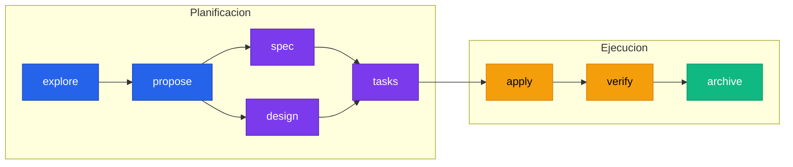
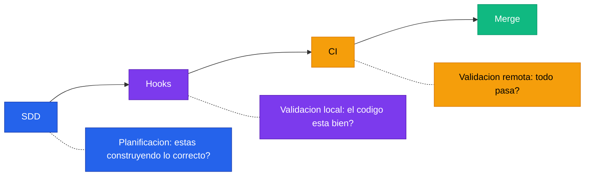

# Setup de SDD

---

## Por que SDD

Pensalo un momento. Le pedis a la IA que implemente un sistema de examenes. La IA te genera 15 archivos, 800 lineas de codigo, tests que pasan, y todo "funciona". Genial. Ahora avanza 3 meses. Algo se rompe. Alguien pregunta: por que se eligio esta estructura? Que casos de borde se consideraron? Cual era el criterio de aceptacion original?

Silencio. No hay documentacion de diseño. No hay specs formales. No hay registro de las decisiones. Solo codigo que "funcionaba" y un historial de commits que dice `feat: add exams system`.

Ese es el problema. Saltar directo al codigo con IA produce software que compila pero que no tiene TRAZABILIDAD. Y sin trazabilidad, cada cambio futuro es una apuesta a ciegas.

SDD — Spec-Driven Development — fuerza estructura ANTES de tocar codigo. No es burocracia. Es disciplina. La misma disciplina que esperarias en un proyecto de construccion: primero los planos, despues los ladrillos. Primero las especificaciones, despues la implementacion.

Y aca viene la clave: con IA, el costo de esa disciplina es practicamente CERO. La IA escribe las specs, el documento de diseño, el breakdown de tareas. Vos revisas y aprobas. El pensamiento queda estructurado, la ejecucion queda automatizada, y cada decision queda documentada.

> SDD no te hace mas lento. Te hace mas SEGURO.
> **Planos antes que ladrillos. Specs antes que codigo. Siempre.**

---

## El grafo de dependencias

Cada cambio significativo pasa por un pipeline de fases. Cada fase recibe artefactos de las anteriores y produce artefactos para las siguientes. Lo critico: spec y design pueden correr EN PARALELO despues del proposal, porque uno describe el QUE y el otro el COMO.



:::info[Spec y Design en paralelo]
El spec define QUE debe hacer el sistema (requerimientos, escenarios). El design define COMO hacerlo (arquitectura, flujo de datos). Son independientes entre si pero ambos dependen del proposal. Esto significa que la IA puede ejecutar ambas fases al mismo tiempo, ahorrando una ronda completa de ida y vuelta.
:::

---

## Las fases

Cada fase es ejecutada por un sub-agente especializado. Recibe artefactos de fases anteriores, produce un artefacto para las siguientes, y tiene reglas claras de scope. Nadie se sale de su rol.

| Fase | Recibe | Produce | Descripcion |
|:---|:---|:---|:---|
| **explore** | Contexto del proyecto | Analisis estructurado | Investiga el codebase, analiza opciones, identifica riesgos |
| **propose** | Exploracion (opcional) | Proposal formal | Define intencion, scope, enfoque, plan de rollback |
| **spec** | Proposal | Delta specs | Requerimientos RFC 2119 + escenarios Given/When/Then |
| **design** | Proposal | Documento de diseño | Decisiones de arquitectura, flujo de datos, cambios por archivo |
| **tasks** | Spec + Design | Checklist accionable | Tareas concretas organizadas por fases de implementacion |
| **apply** | Tasks + Spec + Design | Codigo real | Implementa siguiendo specs y diseño al pie de la letra |
| **verify** | Spec + Tasks | Reporte de compliance | Valida implementacion contra specs con ejecucion REAL |
| **archive** | Todos los artefactos | Reporte de cierre | Sincroniza delta specs y archiva el cambio completado |

### explore

Investiga el codebase sin tocar nada. Analiza la estructura existente, identifica patrones, evalua opciones de implementacion, y produce un analisis estructurado. Es el equivalente a recorrer la obra antes de dibujar los planos.

**Reglas clave:**
- Solo investiga, NUNCA modifica codigo
- Analiza opciones con tradeoffs explicitos
- Identifica riesgos y dependencias antes de que sean sorpresas

### propose

Crea una propuesta formal y concisa. Define la intencion del cambio, el scope, el enfoque tecnico elegido, los riesgos identificados, el plan de rollback, y los criterios de exito. Maximo 400 palabras — si no podes explicar un cambio en 400 palabras, probablemente el scope es demasiado grande.

**Reglas clave:**
- Scope acotado: si es muy grande, hay que partirlo
- Criterios de exito medibles y verificables
- Plan de rollback explicito — siempre tener la salida de emergencia

### spec

Produce delta specs con requerimientos formales usando RFC 2119 (MUST, SHOULD, MAY) y escenarios en formato Given/When/Then. Las specs describen QUE debe hacer el sistema, no COMO. Maximo 650 palabras.

**Reglas clave:**
- Requerimientos en RFC 2119 — no hay ambiguedad sobre que es obligatorio
- Escenarios Given/When/Then para cada caso relevante
- Nunca mezcla el QUE con el COMO — eso es trabajo del design

### design

Captura COMO implementar: decisiones de arquitectura, flujo de datos, cambios por archivo, y la justificacion de cada decision. Sigue los patrones existentes del proyecto — no inventa arquitecturas nuevas sin razon. Maximo 800 palabras.

**Reglas clave:**
- Respeta los patrones existentes del proyecto
- Documenta las decisiones con su justificacion (el "por que")
- Detalla cambios archivo por archivo — sin sorpresas en la implementacion

### tasks

Descompone el trabajo en tareas concretas y accionables, organizadas en fases: Foundation, Core, Integration, Testing, Cleanup. Cada tarea es un checkbox que se puede marcar como completo. Maximo 530 palabras.

**Reglas clave:**
- Cada tarea es atomica y verificable
- El orden de las fases minimiza riesgo (base primero, integracion despues)
- Incluye tareas de cleanup — la IA tiende a olvidar la limpieza si no se lo pedis

### apply

Implementa las tareas escribiendo codigo real, siguiendo las specs y el diseño estrictamente. Marca cada tarea como completada a medida que avanza. Si el diseño resulta incorrecto, REPORTA en vez de desviarse.

**Reglas clave:**
- Sigue specs y diseño al pie de la letra — sin "mejoras" no documentadas
- Si algo del diseño no funciona, reporta el problema en vez de improvisar
- Marca progreso tarea por tarea para permitir reanudar si se corta la sesion

:::warning[La IA no improvisa]
Si durante apply el sub-agente detecta que el diseño tiene un error o una inconsistencia, su trabajo es REPORTARLO. No corregirlo silenciosamente, no tomar atajos, no "mejorar" nada que no este en las specs. La desviacion silenciosa es exactamente lo que SDD esta diseñado para prevenir.
:::

### verify

Quality gate. Valida la implementacion contra las specs usando ejecucion REAL: corre tests, verifica builds, ejecuta los escenarios. Produce una Spec Compliance Matrix con el estado de cada requerimiento: COMPLIANT, FAILING, UNTESTED, o PARTIAL.

**Reglas clave:**
- Validacion con ejecucion real, no revision visual
- NO corrige issues — solo los reporta. Es un auditor, no un dev
- Produce una matriz de compliance que no deja nada a la interpretacion

### archive

Cierra el ciclo. Sincroniza los delta specs con las specs principales del proyecto y archiva el cambio completado. Solo archiva si no hay issues criticos pendientes.

**Reglas clave:**
- Nunca archiva con issues criticos sin resolver
- Actualiza las specs principales del proyecto con los delta specs
- Deja un registro completo para futuras referencias

---

## Comandos

Para usar SDD, tenes estos comandos disponibles en tu sesion de Claude Code:

| Comando | Que hace |
|:---|:---|
| `/sdd-init` | Inicializa el contexto SDD en el proyecto. Analiza la estructura y registra los patrones existentes |
| `/sdd-new <cambio>` | Arranca un cambio nuevo. Ejecuta explore + propose automaticamente |
| `/sdd-ff <cambio>` | Fast-forward: corre propose, spec, design, y tasks de una sola vez |
| `/sdd-apply <cambio>` | Implementa las tareas en batches. Podes ejecutarlo multiples veces si hay varias fases |
| `/sdd-verify <cambio>` | Valida la implementacion contra las specs. Produce la Spec Compliance Matrix |
| `/sdd-archive <cambio>` | Archiva el cambio completado y sincroniza las specs del proyecto |

### Flujo completo en la practica

Supongamos que necesitas implementar un sistema de examenes. Asi se ve el flujo completo:

```bash
# 1. Inicializar SDD en el proyecto (una sola vez)
/sdd-init

# 2. Arrancar el cambio — explore el codebase y genera un proposal
/sdd-new exams-system

# 3. Revisar el proposal. Si esta bien, fast-forward para generar
#    spec, design y tasks de una sola vez
/sdd-ff exams-system

# 4. Revisar specs, diseño y tareas. Cuando estes conforme, implementar.
#    Podes ejecutar apply varias veces si hay muchas tareas
/sdd-apply exams-system

# 5. Validar que la implementacion cumple con las specs
/sdd-verify exams-system

# 6. Si todo esta COMPLIANT, archivar y cerrar el ciclo
/sdd-archive exams-system
```

:::tip[Vos revisas, la IA ejecuta]
Entre cada paso, vos lees el artefacto generado y decidis si avanzar. Si el proposal no te convence, lo discutis y se ajusta ANTES de generar specs. Si el diseño tiene problemas, lo corregis ANTES de implementar. SDD te da puntos de control claros donde vos — el humano — tomas las decisiones.
:::

---

## Por que funciona con IA

Por que SDD funciona tan bien con agentes de IA? Porque cada fase tiene exactamente las propiedades que un sub-agente necesita:

**Costo practicamente cero.** Escribir specs, documentos de diseño y breakdowns de tareas son tareas que a un humano le llevan horas. A la IA le llevan segundos. El costo de la disciplina desaparecio — lo que queda es puro beneficio.

**Input y output claros.** Cada fase recibe artefactos especificos y produce un artefacto especifico. No hay ambiguedad sobre que tiene que hacer el sub-agente. Esto es perfecto para delegacion: le pasas el input, te devuelve el output, listo.

**El verify cierra el loop.** Este es el punto mas importante. Las specs definen QUE tiene que pasar. Apply implementa. Verify valida que la implementacion CUMPLE con las specs. Es el mismo principio que el CI, pero a nivel de diseño: definir expectativas, ejecutar, validar contra las expectativas.

**Persistencia entre sesiones.** Los artefactos se guardan en Engram, lo que significa que sobreviven resets de contexto y compactaciones. Podes arrancar una sesion, generar specs y diseño, y en otra sesion correr apply — los artefactos siguen ahi. Sin persistencia, SDD no funcionaria con IA.

> Cada fase de SDD es un contrato claro entre vos y la IA.
> **Vos definís el QUE. La IA ejecuta el COMO. Y verify se asegura de que lo hizo bien.**

---

## SDD como complemento del CI

Si leiste las guias anteriores, ya tenes los linters al maximo, los hooks atrapando errores localmente, y el CI validando todo antes del merge. Todo eso garantiza que el codigo se CONSTRUYE bien. Pero ninguno de esos checks te dice si estas construyendo lo CORRECTO.

Ahi entra SDD. Es el layer de PLANIFICACION.



- **Linters** ponen la vara alta de calidad de codigo
- **Hooks** atrapan errores en segundos, antes de que el codigo salga de tu maquina
- **CI** valida todo — tests, build, seguridad — de forma obligatoria
- **SDD** agrega el layer que faltaba: asegura que ANTES de escribir codigo, hay un plan, hay specs, hay un diseño documentado

Los cuatro layers se complementan. SDD no reemplaza al CI, igual que los hooks no reemplazan al CI. Cada uno opera en un nivel distinto. Y con IA, el costo de mantener los cuatro es practicamente nulo.

:::tip[Conclusion]
El CI te garantiza que el codigo esta bien escrito. SDD te garantiza que estas escribiendo lo que hay que escribir. Los dos juntos, con IA ejecutando, te dan trazabilidad completa desde la decision de diseño hasta el merge. **Sin atajos. Sin improvisacion. Sin codigo huerfano que nadie sabe por que existe.**
:::
