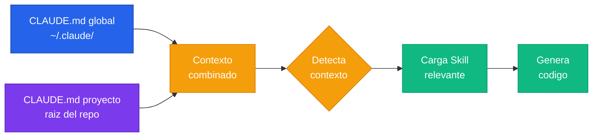

# Setup de Skills y CLAUDE.md

---

## Dos capas, un solo contexto

Claude Code tiene dos mecanismos para recibir instrucciones: **CLAUDE.md** y **Skills**. Los dos se complementan, pero cumplen roles distintos.

**CLAUDE.md** define QUE hacer en este proyecto. Es el contrato: stack, convenciones, reglas, arquitectura. Todo lo que aplica especificamente a ESTE repositorio.

**Skills** definen COMO hacer un tipo de tarea. Son expertise reutilizable: como crear un componente Angular, como escribir tests, como configurar Docker. Aplican a cualquier proyecto donde esa tecnologia aparezca.

La analogia es simple. CLAUDE.md es el plano de TU edificio — materiales, medidas, restricciones del terreno. Los Skills son el manual del albañil — como mezclar cemento, como levantar una pared. El albañil sabe hacer paredes en general, pero necesita el plano para saber donde ponerlas en TU edificio.

---

## Como Claude Code carga el contexto



Primero carga el CLAUDE.md global (tus preferencias personales), despues el del proyecto (reglas del equipo). Con ese contexto combinado, detecta que tipo de tarea estas pidiendo y carga el Skill que matchea. Recien ahi genera codigo — con TODAS las instrucciones aplicadas.

---

## CLAUDE.md — las reglas del proyecto

El CLAUDE.md es un archivo Markdown en la raiz del repo. Le dice a Claude Code todo lo que necesita saber sobre tu proyecto: que stack usas, que patrones seguir, que esta prohibido.

```markdown title="CLAUDE.md"
# Proyecto: Mi App Angular

## Stack
- Angular 19 con standalone components y signals
- NestJS 11 en backend
- PostgreSQL + Prisma ORM

## Reglas
- Siempre usar OnPush change detection
- No usar `any` — tipar todo
- Tests unitarios obligatorios para services
- Conventional commits en español

## Arquitectura
- Screaming architecture en frontend
- Hexagonal en backend
```

Cuanto mas especifico seas, mejor codigo vas a obtener. No es prosa — son reglas concretas que la IA puede seguir al pie de la letra.

:::info[Donde va el CLAUDE.md]
En la raiz del repositorio. Claude Code lo detecta automaticamente al abrir el proyecto. Tambien puede existir uno global en `~/.claude/CLAUDE.md` para preferencias personales que apliquen a todos tus repos.
:::

:::warning[No lo sobrecargues]
El CLAUDE.md se carga en contexto en CADA interaccion — siempre consume tokens. Si lo llenas con 500 lineas de reglas, estas quemando contexto valioso antes de que la IA lea una sola linea de tu codigo. Mantene el CLAUDE.md conciso y mové las reglas especificas de tecnologia a Skills, que solo se cargan cuando hacen falta.
:::

---

## Skills — expertise reutilizable

Un Skill es un archivo `SKILL.md` con instrucciones para un tipo de tarea especifico: crear componentes Angular, configurar Docker, escribir tests con Vitest. Cada Skill tiene un **trigger** que le dice a Claude Code CUANDO cargarlo.

```markdown title=".claude/skills/angular/SKILL.md"
# Angular — Standalone Components

## Trigger
Crear componente Angular, refactorizar componente, routing Angular

## Reglas
- Siempre standalone: true (no NgModules)
- Signals para estado, no BehaviorSubject
- OnPush change detection obligatorio
- Smart/Dumb: containers manejan logica, presentationals solo @Input/@Output
```

La diferencia con CLAUDE.md es que un Skill NO se carga siempre — solo cuando el contexto de la tarea matchea su trigger. Si le pedis a Claude Code que escriba un Dockerfile, no necesita tus reglas de Angular. Cada Skill es expertise on-demand.

:::info[Donde viven los Skills]
En `~/.claude/skills/` (globales, para todos tus proyectos) o en `.claude/skills/` dentro del repo (compartidos con el equipo). Los del proyecto tienen prioridad sobre los globales.
:::

---

## CLAUDE.md vs Skills — cuando usar cada uno

| Caracteristica | CLAUDE.md | Skills |
|---|---|---|
| Scope | Un proyecto especifico | Reutilizable entre proyectos |
| Ubicacion | Raiz del repo | `~/.claude/skills/` o `.claude/skills/` |
| Se carga | Siempre, automaticamente | Solo cuando el contexto matchea el trigger |
| Contenido tipico | Stack, reglas, arquitectura, convenciones | Patrones de codigo, templates, reglas por tecnologia |
| Quien lo mantiene | El equipo del proyecto | El dev o el equipo (si esta en el repo) |
| Ejemplo | "Usar Prisma, no TypeORM" | "Como crear un service en NestJS" |

:::warning[No los mezcles]
El error mas comun es meter reglas de tecnologia especifica en el CLAUDE.md. Si una regla aplica a Angular en TODOS tus proyectos, va en un Skill. Si aplica solo a ESTE proyecto, va en CLAUDE.md. La regla es simple: si lo copiarias a otro repo, es un Skill.
:::

---

## La estructura recomendada

```
mi-proyecto/
├── CLAUDE.md                          # Reglas del proyecto
├── .claude/
│   └── skills/
│       └── mi-skill-custom/
│           └── SKILL.md               # Skill compartido con el equipo
├── src/
│   └── ...
└── ...

~/.claude/
├── CLAUDE.md                          # Preferencias personales (global)
└── skills/
    ├── angular/
    │   └── SKILL.md                   # Skill global — Angular
    ├── docker/
    │   └── SKILL.md                   # Skill global — Docker
    └── testing/
        └── SKILL.md                   # Skill global — Testing
```

Los skills globales son TUS herramientas personales. Los skills del proyecto se versionan con el repo y los comparte todo el equipo. Esto te permite tener un setup base que funciona en cualquier repo, y al mismo tiempo compartir convenciones especificas con tu equipo sin que cada uno tenga que configurar nada.

---

## El cuadro completo

CLAUDE.md y Skills son la primera capa del sistema. Definen la **calidad BASE** del codigo que genera la IA — antes de que intervenga ningun otro mecanismo.

Pero no trabajan solos. Los hooks validan localmente que el codigo cumpla las reglas. El CI valida en remoto que nada se rompa. Y SDD planifica antes de ejecutar para que los cambios grandes no sean un desastre.

Las cuatro capas juntas forman el sistema completo: **instrucciones → validacion local → validacion remota → planificacion**.

:::tip[Explora el catalogo]
Ya tenes el contexto de que son y cuando usar cada uno. Ahora anda a ver que hay disponible:
- **[Ver catalogo de Claude Skills →](../claude-skills/java-skill)** — skills listos para descargar e instalar
- **[Ver ejemplos de CLAUDE.md →](../claude-md/)** — templates de CLAUDE.md por stack
:::

:::tip[Conclusion]
CLAUDE.md es tu contrato con la IA para este proyecto. Los Skills son tu biblioteca de expertise. Configuralos bien y la IA va a generar codigo que ya cumple tus estandares ANTES de que lo revise ningun linter ni ningun hook. **Es la inversion con mayor retorno de todo el handbook.**
:::
