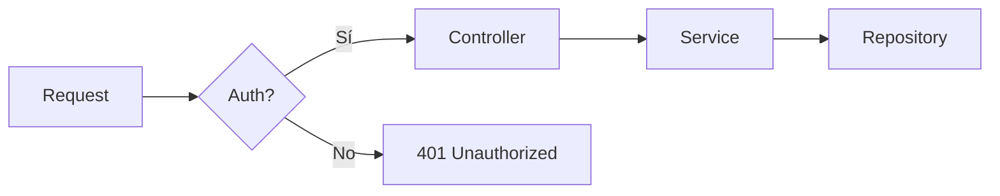

# Docusaurus Skill

## Reglas Críticas

### ALWAYS

| Regla | Detalle |
|-------|---------|
| Usar CSS custom properties | Todo color, fuente y espaciado va en `:root` y `[data-theme='dark']` |
| Soporte dark mode | Cada estilo custom DEBE tener su contraparte `[data-theme='dark']` |
| CSS Modules para componentes | Archivos `styles.module.css` al lado del componente |
| Frontmatter completo en docs | `id`, `title`, `sidebar_label` como mínimo |
| Estructura de carpetas estándar | `docs/`, `src/pages/`, `src/components/`, `src/css/`, `static/` |
| Tipografía con jerarquía clara | Headings con font-family distinta al body |
| Responsive design | Todo componente custom debe funcionar en mobile (< 768px) |
| Contenido en español (Rioplatense) | Labels, sidebars, footer, admonitions |
| Imágenes en `static/img/` | Referenciar con `/img/nombre.png` (ruta absoluta desde static) |
| Sidebar colapsable | `hideable: true` en `themeConfig.docs.sidebar` |

### NEVER

| Regla | Detalle |
|-------|---------|
| Colores hardcodeados en componentes | Siempre usar `var(--nombre-variable)` |
| Estilos inline en JSX | Usar CSS Modules o clases de Infima |
| `!important` sin justificación | Solo para sobreescribir Infima cuando no hay otra opción |
| Docs sin `id` en frontmatter | Rompe las referencias en `sidebars.js` |
| Imágenes pesadas sin optimizar | Comprimir antes de agregar a `static/` |
| Modificar archivos en `node_modules/` | Usar swizzling: `npx docusaurus swizzle` |
| CSS global para componentes custom | Cada componente tiene su `styles.module.css` |
| Romper la estructura de `sidebars.js` | Respetar el patrón de categorías anidadas |
| Mezclar idiomas en la UI | Si el sitio es en español, TODO en español |
| Deployar sin verificar build | Siempre correr `npm run build` antes de push |

---

## Estructura de Proyecto

```
mi-sitio/
├── docs/                          # Contenido markdown/MDX
│   ├── intro.md                   # Página principal de docs
│   ├── categoria/
│   │   ├── doc-uno.md
│   │   └── doc-dos.md
│   └── otra-categoria/
│       └── subtema/
│           └── detalle.md
├── src/
│   ├── components/                # Componentes React reutilizables
│   │   └── MiComponente/
│   │       ├── index.tsx          # Componente
│   │       └── styles.module.css  # Estilos scoped
│   ├── css/
│   │   └── custom.css             # Design system global
│   └── pages/                     # Páginas custom (landing, about)
│       └── index.tsx              # Landing page
├── static/                        # Assets estáticos (copiados tal cual al build)
│   ├── img/
│   └── skills/
├── docusaurus.config.js           # Configuración principal
├── sidebars.js                    # Estructura de navegación
└── package.json
```

**Regla clave**: los docs van en `docs/`, las páginas custom en `src/pages/`, los componentes en `src/components/`. No mezclar.

---

## Configuración — `docusaurus.config.js`

### Estructura base

```javascript
import { themes as prismThemes } from 'prism-react-renderer';

/** @type {import('@docusaurus/types').Config} */
const config = {
  title: 'Mi Sitio',
  tagline: 'Descripción corta del sitio',
  favicon: 'img/favicon.png',

  url: 'https://mi-org.github.io',
  baseUrl: '/mi-repo/',

  organizationName: 'mi-org',
  projectName: 'mi-repo',
  deploymentBranch: 'gh-pages',

  onBrokenLinks: 'throw',        // Falla en build si hay links rotos
  onBrokenMarkdownLinks: 'warn',

  i18n: {
    defaultLocale: 'es',
    locales: ['es'],
  },

  presets: [
    [
      'classic',
      /** @type {import('@docusaurus/preset-classic').Options} */
      ({
        docs: {
          sidebarPath: './sidebars.js',
          routeBasePath: '/',          // Docs como página principal
          editUrl: 'https://github.com/mi-org/mi-repo/tree/main/',
        },
        blog: false,                   // Desactivar si no se usa
        theme: {
          customCss: './src/css/custom.css',
        },
      }),
    ],
  ],

  themeConfig:
    /** @type {import('@docusaurus/preset-classic').ThemeConfig} */
    ({
      image: 'img/social-card.png',
      docs: {
        sidebar: {
          hideable: true,             // Permite colapsar sidebar
        },
      },
      navbar: {
        title: '',
        logo: {
          alt: 'Mi Sitio',
          src: 'img/logo.png',
          srcDark: 'img/logo-dark.png',  // Logo para dark mode
        },
        items: [
          // Items del navbar
        ],
      },
      footer: {
        style: 'dark',
        copyright: `© ${new Date().getFullYear()} Mi Organización.`,
      },
      prism: {
        theme: prismThemes.github,
        darkTheme: prismThemes.dracula,
        additionalLanguages: ['bash', 'json', 'yaml', 'sql'],
      },
    }),
};

export default config;
```

### Configuraciones comunes

| Opción | Uso | Ejemplo |
|--------|-----|---------|
| `routeBasePath: '/'` | Docs como home (sin `/docs/` en URL) | Sitios 100% documentación |
| `blog: false` | Desactivar blog | Sitios sin blog |
| `onBrokenLinks: 'throw'` | Fallar build si hay links rotos | Siempre recomendado |
| `hideable: true` | Sidebar colapsable | Mejor UX en pantallas chicas |
| `editUrl` | Botón "Editar esta página" | Colaboración en GitHub |
| `additionalLanguages` | Syntax highlighting extra | Lenguajes no incluidos por defecto |

### Plugins opcionales

```javascript
// Mermaid para diagramas
themes: ['@docusaurus/theme-mermaid'],
markdown: {
  mermaid: true,
},

// Algolia DocSearch
themeConfig: {
  algolia: {
    appId: 'TU_APP_ID',
    apiKey: 'TU_API_KEY_PUBLICA',
    indexName: 'tu-index',
    contextualSearch: true,
  },
},
```

---

## Diseno y Theming

Esta es la sección más importante. Un sitio Docusaurus sin diseño custom es un sitio genérico.

### Sistema de Design Tokens (CSS Custom Properties)

El archivo `src/css/custom.css` es el corazón del design system. TODO pasa por variables CSS.

```css
/**
 * Design System — Tokens
 *
 * Paleta de marca:
 *   Primario  : #8B3DB8 (purple)
 *   Acento    : #F05023 (orange)
 *   Oscuro    : #3C0A5E (deep purple)
 *
 * Tipografía:
 *   Headings : Syne (geométrica, técnica)
 *   Body     : DM Sans (limpia, legible)
 *   Code     : JetBrains Mono
 */

@import url('https://fonts.googleapis.com/css2?family=Syne:wght@400;500;600;700;800&family=DM+Sans:opsz,wght@9..40,300;9..40,400;9..40,500;9..40,600&family=JetBrains+Mono:wght@300;400;500;600&display=swap');
```

### Tokens Light Mode (`:root`)

```css
:root {
  /* ── Paleta de marca ── */
  --brand-deep:    #1E0535;
  --brand-dark:    #3C0A5E;
  --brand-mid:     #8B3DB8;
  --brand-soft:    #B06CD8;
  --brand-accent:  #F05023;
  --brand-accent-light: #FF6B42;
  --brand-accent-dim:   rgba(240, 80, 35, 0.15);

  /* ── Infima primary (OBLIGATORIO — Docusaurus los usa internamente) ── */
  --ifm-color-primary:          #8B3DB8;
  --ifm-color-primary-dark:     #7A34A3;
  --ifm-color-primary-darker:   #6E2E93;
  --ifm-color-primary-darkest:  #3C0A5E;
  --ifm-color-primary-light:    #9C4EC9;
  --ifm-color-primary-lighter:  #B06CD8;
  --ifm-color-primary-lightest: #C990E8;

  /* ── Tipografía ── */
  --ifm-font-family-base:      'DM Sans', system-ui, -apple-system, sans-serif;
  --ifm-heading-font-family:   'Syne', system-ui, sans-serif;
  --ifm-font-family-monospace: 'JetBrains Mono', 'Fira Code', monospace;

  --ifm-font-size-base:     15.5px;
  --ifm-line-height-base:   1.7;
  --ifm-heading-font-weight: 700;
  --ifm-font-weight-bold:    600;

  /* ── Espaciado y radios ── */
  --ifm-navbar-height:   62px;
  --ifm-code-font-size:  88%;
  --ifm-global-radius:   6px;

  /* ── Sombras ── */
  --shadow-sm:  0 1px 4px rgba(60, 10, 94, 0.08);
  --shadow-md:  0 4px 16px rgba(60, 10, 94, 0.12);
  --shadow-lg:  0 8px 32px rgba(60, 10, 94, 0.18);

  --docusaurus-highlighted-code-line-bg: rgba(240, 80, 35, 0.08);
}
```

### Tokens Dark Mode (`[data-theme='dark']`)

```css
[data-theme='dark'] {
  /* Infima primary — más claro para contraste sobre fondo oscuro */
  --ifm-color-primary:           #C07EE8;
  --ifm-color-primary-dark:      #B068DF;
  --ifm-color-primary-darker:    #A355D4;
  --ifm-color-primary-darkest:   #8B3DB8;
  --ifm-color-primary-light:     #D09CF0;
  --ifm-color-primary-lighter:   #DAB0F4;
  --ifm-color-primary-lightest:  #EDD4FA;

  /* Fondos */
  --ifm-background-color:         #140322;
  --ifm-background-surface-color: #1C0830;
  --ifm-navbar-background-color:  #0F0219;
  --ifm-footer-background-color:  #0A011A;

  /* Texto */
  --ifm-color-content:           #E8DFF4;
  --ifm-color-content-secondary: #B89FCC;

  /* Bordes */
  --ifm-toc-border-color: rgba(139, 61, 184, 0.2);
  --ifm-hr-border-color:  rgba(139, 61, 184, 0.15);

  --docusaurus-highlighted-code-line-bg: rgba(240, 80, 35, 0.12);

  --shadow-sm:  0 1px 6px rgba(0, 0, 0, 0.35);
  --shadow-md:  0 4px 20px rgba(0, 0, 0, 0.4);
  --shadow-lg:  0 8px 40px rgba(0, 0, 0, 0.5);
}
```

**Regla**: por cada token en `:root`, verificá si necesita override en `[data-theme='dark']`. Especialmente colores de fondo, texto y sombras.

### Jerarquía Tipográfica

Docusaurus usa Infima, que respeta estas variables. La clave es separar la font de headings del body.

```css
/* Headings — fuente geométrica/display */
h1, h2, h3, h4, h5, h6 {
  font-family: var(--ifm-heading-font-family);
  letter-spacing: -0.02em;
}

/* H1 del contenido — acento visual */
.markdown h1 {
  font-size: 2.1rem;
  font-weight: 800;
  color: var(--brand-dark);
  border-bottom: 2px solid var(--brand-accent);
  padding-bottom: 0.5rem;
  margin-bottom: 1.5rem;
}

[data-theme='dark'] .markdown h1 {
  color: #EDD4FA;
}

/* H2 — secciones principales */
.markdown h2 {
  font-size: 1.45rem;
  font-weight: 700;
  color: var(--brand-dark);
  margin-top: 2.5rem;
}

[data-theme='dark'] .markdown h2 {
  color: #C07EE8;
}

/* H3 — subsecciones */
.markdown h3 {
  font-size: 1.15rem;
  font-weight: 600;
  color: var(--brand-mid);
}

[data-theme='dark'] .markdown h3 {
  color: #B89FCC;
}
```

### Navbar

```css
.navbar {
  border-bottom: 2px solid var(--brand-accent);
  box-shadow: var(--shadow-md);
  backdrop-filter: blur(8px);
  -webkit-backdrop-filter: blur(8px);
}

[data-theme='dark'] .navbar {
  background-color: rgba(15, 2, 25, 0.92);
}

.navbar__title {
  font-family: var(--ifm-heading-font-family);
  font-weight: 700;
  letter-spacing: -0.02em;
}

.navbar__link:hover,
.navbar__link--active {
  color: var(--brand-accent) !important;
}
```

### Sidebar

```css
/* Sidebar — borde sutil */
.theme-doc-sidebar-container {
  border-right: 1px solid rgba(139, 61, 184, 0.12) !important;
}

/* Link activo — acento visual con borde izquierdo */
.menu__link--active:not(.menu__link--sublist) {
  background-color: rgba(240, 80, 35, 0.09);
  color: var(--brand-dark);
  font-weight: 600;
  border-left: 3px solid var(--brand-accent);
  padding-left: calc(0.75rem - 3px);
}

/* Categorías — uppercase, pequeñas, como labels */
.menu__list-item-collapsible .menu__link--sublist {
  font-weight: 600;
  font-size: 0.78rem;
  letter-spacing: 0.06em;
  text-transform: uppercase;
  color: var(--brand-mid);
  opacity: 0.8;
}
```

### Code Blocks

```css
code {
  font-family: var(--ifm-font-family-monospace);
  background-color: rgba(139, 61, 184, 0.07);
  border: 1px solid rgba(139, 61, 184, 0.18);
  border-radius: 4px;
  padding: 0.12em 0.42em;
}

[data-theme='dark'] code {
  background-color: rgba(30, 5, 53, 0.7);
  border-color: rgba(139, 61, 184, 0.28);
  color: #DAB0F4;
}

.theme-code-block {
  border-radius: 8px !important;
  box-shadow: var(--shadow-md) !important;
  border: 1px solid rgba(139, 61, 184, 0.15) !important;
}
```

### Tablas

```css
table {
  border-radius: 8px;
  overflow: hidden;
  box-shadow: var(--shadow-sm);
  font-size: 0.9rem;
  width: 100%;
}

thead tr {
  background-color: var(--brand-dark) !important;
}

thead tr th {
  color: #fff !important;
  font-family: var(--ifm-heading-font-family);
  font-weight: 600;
  font-size: 0.8rem;
  letter-spacing: 0.05em;
  text-transform: uppercase;
}

[data-theme='dark'] thead tr {
  background-color: #1E0535 !important;
}
```

### Admonitions

```css
.alert {
  border-radius: 8px;
  border-left-width: 3px;
  font-size: 0.9rem;
}

.alert--info {
  --ifm-alert-border-color: var(--brand-mid);
  background-color: rgba(139, 61, 184, 0.07);
}

.alert--tip {
  --ifm-alert-border-color: #2ECC71;
  background-color: rgba(46, 204, 113, 0.06);
}

.alert--warning {
  --ifm-alert-border-color: var(--brand-accent);
  background-color: rgba(240, 80, 35, 0.06);
}

.alert--danger {
  --ifm-alert-border-color: #E74C3C;
  background-color: rgba(231, 76, 60, 0.06);
}
```

### Footer

```css
.footer {
  background-color: var(--brand-deep);
  border-top: 1px solid rgba(240, 80, 35, 0.3);
}

.footer__link-item:hover {
  color: var(--brand-accent);
}
```

### Patrón completo de responsive

```css
/* Base global */
html {
  scroll-behavior: smooth;
}

body {
  font-feature-settings: 'liga' 1, 'kern' 1;
  -webkit-font-smoothing: antialiased;
  text-rendering: optimizeLegibility;
}

/* Contenido — ancho máximo legible */
.theme-doc-markdown {
  max-width: 860px;
}

/* Scrollbar custom (Webkit) */
::-webkit-scrollbar { width: 6px; height: 6px; }
::-webkit-scrollbar-track { background: transparent; }
::-webkit-scrollbar-thumb {
  background: rgba(139, 61, 184, 0.3);
  border-radius: 3px;
}
```

### Generador de paleta Infima

Docusaurus necesita 7 tonos del color primario. Usá esta herramienta oficial:

> https://docusaurus.io/docs/styling-layout#styling-your-site-with-infima

Ingresá tu color primario y te genera los 7 valores: `primary`, `dark`, `darker`, `darkest`, `light`, `lighter`, `lightest`.

---

## Contenido y MDX

### Frontmatter estándar

```markdown
---
id: mi-documento            # Identificador único (se usa en sidebars.js)
title: "Título del doc"     # Título principal
sidebar_label: "Etiqueta"  # Nombre corto en el sidebar
description: "Descripción para SEO y social cards"
---
```

### Admonitions

```markdown
:::tip Título del tip
Contenido del tip — para buenas prácticas o atajos.
:::

:::info Nota informativa
Información adicional que complementa el contenido.
:::

:::warning Cuidado
Algo que puede salir mal si no se tiene en cuenta.
:::

:::danger Peligro
Esto puede romper cosas. Prestar atención.
:::

:::note Nota
Información general no crítica.
:::
```

### Tabs

```markdown
import Tabs from '@theme/Tabs';
import TabItem from '@theme/TabItem';

<Tabs>
  <TabItem value="npm" label="npm" default>
    npm install mi-paquete
  </TabItem>
  <TabItem value="yarn" label="yarn">
    yarn add mi-paquete
  </TabItem>
</Tabs>
```

### Code Blocks con título y líneas resaltadas

````markdown
```typescript title="src/services/user.service.ts"
// highlight-next-line
export class UserService {
  // highlight-start
  async findAll(): Promise<User[]> {
    return this.repository.find();
  }
  // highlight-end
}
```
````

### Diagramas Mermaid

Requiere plugin `@docusaurus/theme-mermaid` y `markdown.mermaid: true` en config.

````markdown

````

### Links internos

```markdown
<!-- A otro doc por ID -->
[Ver configuración](./configuracion)

<!-- A un heading específico -->
[Ver sección de diseño](./mi-doc#diseno)

<!-- Assets estáticos -->


<!-- Descarga de archivos -->
<a href="/mi-repo/skills/mi-skill/SKILL.md" download="SKILL.md">Descargar</a>
```

---

## Sidebars

### Estructura en `sidebars.js`

```javascript
module.exports = {
  docs: [
    // Doc suelto al nivel raíz
    {
      type: 'doc',
      id: 'intro',
      label: 'Introducción',
    },
    // Categoría con docs
    {
      type: 'category',
      label: 'Backend',
      items: [
        {
          type: 'category',
          label: 'Java',
          items: [
            'backend/java/configuracion',
            'backend/java/arquitectura',
          ],
        },
      ],
    },
    // Categoría colapsada por defecto
    {
      type: 'category',
      label: 'Avanzado',
      collapsed: true,        // Arranca cerrada
      collapsible: true,      // Se puede abrir/cerrar
      items: ['avanzado/tema-uno'],
    },
    // Index generado automáticamente
    {
      type: 'category',
      label: 'API Reference',
      link: {
        type: 'generated-index',
        title: 'API Reference',
        description: 'Referencia completa de la API.',
      },
      items: ['api/endpoints', 'api/auth'],
    },
  ],
};
```

### Patrones de organización

| Patrón | Cuándo usar |
|--------|-------------|
| `type: 'doc'` al raíz | Docs principales (intro, getting started) |
| Categorías anidadas | Agrupar por dominio: `Backend > Java > tema` |
| `collapsed: true` | Secciones secundarias que no necesitan estar abiertas |
| `generated-index` | Categorías que listan sus hijos automáticamente |
| ID como path | `'backend/java/config'` → `docs/backend/java/config.md` |

### Agregar un nuevo doc

1. Crear `docs/mi-categoria/mi-doc.md` con frontmatter (`id`, `title`, `sidebar_label`)
2. Agregar el `id` en `sidebars.js` dentro de la categoría correcta
3. Verificar con `npm start` que aparece en el sidebar

---

## Landing Pages

Las landing pages son componentes React en `src/pages/`. NO son docs markdown.

### Patrón HomepageFeatures

```jsx
// src/components/HomepageFeatures/index.jsx
import clsx from 'clsx';
import Heading from '@theme/Heading';
import styles from './styles.module.css';

const FeatureList = [
  {
    title: 'Fácil de usar',
    Svg: require('@site/static/img/feature-1.svg').default,
    description: (
      <>Descripción de la feature.</>
    ),
  },
  {
    title: 'Bien documentado',
    Svg: require('@site/static/img/feature-2.svg').default,
    description: (
      <>Descripción de la feature.</>
    ),
  },
  {
    title: 'Open Source',
    Svg: require('@site/static/img/feature-3.svg').default,
    description: (
      <>Descripción de la feature.</>
    ),
  },
];

function Feature({ Svg, title, description }) {
  return (
    <div className={clsx('col col--4')}>
      <div className="text--center">
        <Svg className={styles.featureSvg} role="img" />
      </div>
      <div className="text--center padding-horiz--md">
        <Heading as="h3">{title}</Heading>
        <p>{description}</p>
      </div>
    </div>
  );
}

export default function HomepageFeatures() {
  return (
    <section className={styles.features}>
      <div className="container">
        <div className="row">
          {FeatureList.map((props, idx) => (
            <Feature key={idx} {...props} />
          ))}
        </div>
      </div>
    </section>
  );
}
```

```css
/* src/components/HomepageFeatures/styles.module.css */
.features {
  display: flex;
  align-items: center;
  padding: 2rem 0;
  width: 100%;
}

.featureSvg {
  height: 200px;
  width: 200px;
}
```

### Hero Section pattern

```jsx
// src/pages/index.tsx
import Layout from '@theme/Layout';
import styles from './index.module.css';

function HeroSection() {
  return (
    <header className={styles.heroBanner}>
      <div className="container">
        <h1 className={styles.heroTitle}>Mi Sitio</h1>
        <p className={styles.heroSubtitle}>Tagline del sitio</p>
        <a className={styles.heroButton} href="/docs/intro">
          Empezar
        </a>
      </div>
    </header>
  );
}

export default function Home() {
  return (
    <Layout description="Descripción para SEO">
      <HeroSection />
      <main>
        <HomepageFeatures />
      </main>
    </Layout>
  );
}
```

---

## Componentes Custom

### Reglas para crear componentes

1. Carpeta propia: `src/components/NombreComponente/`
2. `index.tsx` (o `.jsx`) + `styles.module.css`
3. Usar clases de Infima (`container`, `row`, `col`, `text--center`, `padding-horiz--md`)
4. Colores siempre con `var(--nombre-variable)`
5. Importar con `@site/src/components/NombreComponente`

### Patrón de Card

```jsx
// src/components/Card/index.tsx
import styles from './styles.module.css';

interface CardProps {
  title: string;
  description: string;
  href?: string;
}

export default function Card({ title, description, href }: CardProps) {
  const Wrapper = href ? 'a' : 'div';
  return (
    <Wrapper className={styles.card} href={href}>
      <h3 className={styles.cardTitle}>{title}</h3>
      <p className={styles.cardDescription}>{description}</p>
    </Wrapper>
  );
}
```

```css
/* src/components/Card/styles.module.css */
.card {
  display: block;
  padding: 1.25rem;
  border-radius: var(--ifm-global-radius);
  border: 1px solid rgba(139, 61, 184, 0.15);
  transition: border-color 0.15s, box-shadow 0.15s;
  text-decoration: none;
  color: inherit;
}

.card:hover {
  border-color: var(--ifm-color-primary);
  box-shadow: var(--shadow-md);
}

.cardTitle {
  font-family: var(--ifm-heading-font-family);
  font-size: 1.1rem;
  margin-bottom: 0.5rem;
}

.cardDescription {
  font-size: 0.9rem;
  color: var(--ifm-color-content-secondary);
  margin: 0;
}
```

### Swizzling (personalizar componentes de Docusaurus)

```bash
# Ver qué componentes se pueden swizzle
npx docusaurus swizzle --list

# Swizzle un componente (crea copia local editable)
npx docusaurus swizzle @docusaurus/theme-classic Footer -- --eject

# Wrap (menos invasivo — envuelve el componente original)
npx docusaurus swizzle @docusaurus/theme-classic Footer -- --wrap
```

**Preferir `--wrap` sobre `--eject`** — es más fácil de mantener en upgrades de Docusaurus.

---

## UX Patterns

### Navegación

| Elemento | Configuración | Efecto UX |
|----------|--------------|-----------|
| Sidebar hideable | `docs.sidebar.hideable: true` | Más espacio en pantallas chicas |
| Breadcrumbs | Activados por defecto | Orientación en jerarquía profunda |
| ToC depth | `toc_min_heading_level: 2`, `toc_max_heading_level: 3` | No saturar la tabla de contenidos |
| Navbar logo | `logo.src` + `logo.srcDark` | Coherencia visual en ambos temas |
| Edit link | `editUrl` en config | Colaboración directa desde el doc |

### Optimización de búsqueda

- Usar `description` en frontmatter de cada doc
- Títulos descriptivos (no genéricos como "Introducción")
- Headings jerárquicos: H1 > H2 > H3 (no saltar niveles)
- Keywords relevantes en el primer párrafo del doc

### Mobile

- El sidebar se convierte en drawer automáticamente
- Verificar que tablas no se desborden (usar `overflow-x: auto` si es necesario)
- Cards en grid: usar clases `col col--6` (2 cols en desktop, 1 en mobile)
- Navbar items: no sobrecargar — en mobile se comprimen en hamburger menu

### Paginación entre docs

```css
/* Mejorar la paginación visual */
.pagination-nav {
  gap: 1rem;
  margin-top: 3rem;
  border-top: 1px solid rgba(139, 61, 184, 0.12);
}

.pagination-nav__link:hover {
  border-color: var(--brand-accent);
  box-shadow: 0 0 0 1px var(--brand-accent-dim);
}
```

---

## Comandos Utiles

```bash
# Desarrollo local con hot reload
npm start

# Build de producción (SIEMPRE antes de deploy)
npm run build

# Servir build local para verificar
npm run serve

# Limpiar cache (si hay problemas de build)
npm run clear
# o
npx docusaurus clear

# Deploy a GitHub Pages
npm run deploy
# o
GIT_USER=<tu-user> npm run deploy

# Generar archivos de traducción
npm run write-translations

# Swizzle un componente
npx docusaurus swizzle @docusaurus/theme-classic <Componente>
```

---

## Anti-Patterns

| Anti-Pattern | Problema | Solución |
|-------------|----------|----------|
| Colores hardcodeados | Rompe dark mode, inconsistencia | Usar `var(--nombre)` siempre |
| Estilos inline | No se pueden sobreescribir, no respetan tema | CSS Modules |
| CSS global para componentes | Colisiones de nombres | `styles.module.css` al lado del componente |
| `git add .` antes de build | Sube archivos generados | Verificar `.gitignore`, commitear selectivo |
| Sidebar plano (sin categorías) | Innavegable con más de 10 docs | Agrupar en categorías lógicas |
| Imágenes > 500KB | Carga lenta, mala UX | Comprimir con herramientas como `squoosh.app` |
| H1 duplicados | Docusaurus genera H1 del título | Usar H2 como primer heading en el contenido |
| Docs sin `id` | Links rotos, sidebar references rotas | Siempre incluir `id` en frontmatter |
| Modificar `node_modules` | Se pierde en cada `npm install` | Swizzle o CSS override |
| No verificar dark mode | UI rota para la mitad de los usuarios | Testear ambos temas en cada cambio |
| Navbar sobrecargado | Confuso, especialmente en mobile | Máximo 5-6 items, usar sidebar para el resto |
| No usar `onBrokenLinks: 'throw'` | Links rotos pasan desapercibidos | Siempre `throw` en producción |
